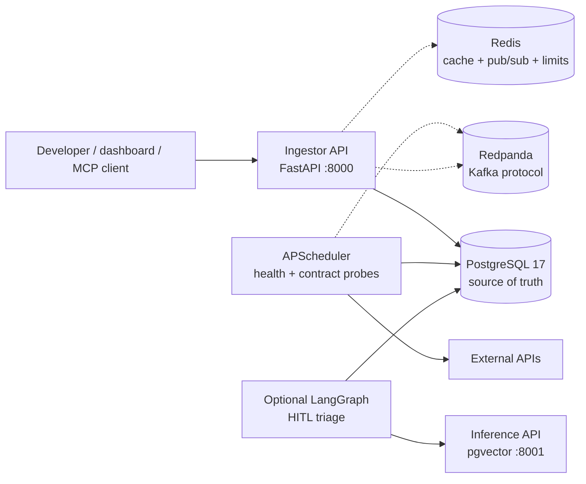

# API Observatory

API Observatory is a Python backend and distributed-systems playground built around a practical
problem: detecting when a third-party API becomes unavailable, slow, or contract-incompatible
before that failure reaches a small SaaS product's users.

The repository is primarily job-preparation evidence, but the demo is a deployable application,
not a code-only exercise. It demonstrates implemented behavior, failure handling, tests, and
architecture decisions, and can be run locally or deployed using the documented infrastructure
contract. No live production operation is claimed.

## What It Demonstrates

- Async FastAPI/Pydantic APIs with JWT, API keys, role guards, tenant context, and opt-in
  PostgreSQL row-level security.
- PostgreSQL/SQLAlchemy/Alembic data design, scorecard aggregation, schema drift, retention, and
  measured query-analysis paths.
- Tenant-scoped dependency incidents with deduplication, notification cooldown, recovery, and
  operator acknowledgement/resolution.
- Scheduled external API probes, Redis caching/pub-sub/rate limiting, and Kafka-compatible event
  delivery with idempotency, outbox/inbox, retries, and DLQ handling.
- Structured logs, Prometheus metrics, OpenTelemetry traces, health/readiness endpoints, failure
  runbooks, and bounded load/fault tests.
- An optional LangGraph incident-triage flow with pgvector retrieval, human review, and deterministic
  offline evaluation.
- Local Docker Compose/k3d infrastructure plus an unexecuted AWS Stage 0 deployment contract shared
  with the sibling infrastructure repository.

## Practical Workflow

1. Register an external API source.
2. Schedule health and response-shape probes.
3. Calculate uptime, latency percentiles, and error-budget signals.
4. Detect breaking response-contract changes.
5. Stream or dispatch operational signals and optionally enrich serious drift with reviewed AI
   analysis.

The standing product example is a solo SaaS developer monitoring payment, authentication, email,
AI, or data dependencies. This context explains engineering choices; customer acquisition, billing,
and permanent hosting are out of scope.

## Architecture



Core local runtime is the ingestor plus PostgreSQL. Redis, Redpanda, inference, monitoring, and the
agent are optional/feature-gated. See [Application Architecture](docs/02-architecture/application-architecture.md)
for exact boundaries and status.

## Quick Start

Create the ignored local configuration file, then generate its private credentials before selecting
a workflow:

```bash
just doctor
cp .env.example .env
just generate-secrets
just dev-up
```

This starts the default HTTP stack. For readiness, migrations, optional demo initialization, smoke
verification, and extended services, continue with the [Setup Guide](docs/04-setup/setup-guide.md).

The committed [`.env.example`](.env.example) contains public development settings only. The local
generator writes real credentials to `.env`; production injects the same names through
infrastructure-owned secret delivery. The [`Justfile`](Justfile) owns the executable workflows.

`just dev-up` is the default HTTP containerized workflow: use <http://127.0.0.1:8000/api/docs> for the
API and <http://127.0.0.1:8501> for the dashboard. HTTPS is an opt-in next step for proxy and
security-specific testing; follow the setup guide to install certificates and enable the ingress
profile. For normal onboarding, use `just dev-up`. `just dev` is an alternative host-process
hot-reload loop for experienced contributors; it is not the canonical default. Never commit the
local `.env` created from it.

For the complete task lifecycle from branch creation through pull request, use
[Contributing](CONTRIBUTING.md). For proof selection, use
[Development Workflows](docs/05-development/dev-workflows.md).

## Recruiter and Interview Tour

1. [Application Lifecycle and SDLC](docs/01-intro/application-lifecycle.md) — the cross-repository
   path from product idea through delivery, operation, maintenance, and transformation.
2. [Application Architecture](docs/02-architecture/application-architecture.md) — current runtime
   and critical flows.
3. [Evergreen Engineering Evidence](docs/02-architecture/engineering-topics.md) — topic status,
   primary proof, and adoption triggers.
4. [Technology Decisions](docs/02-architecture/decisions.md) — durable choices and ADRs.
5. [Interview Package](docs/01-intro/interview-package.md) — demo, defense, and evidence checks.

## Repository Ownership

| Repository | Owns |
| --- | --- |
| `api-observatory` | Application behavior, contracts, migrations, service images, local Compose/k3d, emulators, tests, and developer bootstrap |
| [`api-observatory-infra`](https://github.com/ivanprytula/api-observatory-infra) | Real-cloud Terraform/state, IAM, DNS/TLS, runtime secret delivery, cloud deployment workflows, and production-oriented monitoring assets |

The machine-readable AWS Stage 0 service contract is
[`release/services.json`](release/services.json). AWS is the
primary portfolio direction; no completed live deployment is claimed.

## Evidence Status

Documentation uses five statuses:

- **Core:** implemented and tested in the application path.
- **Lab:** executable/configurable in an isolated local environment.
- **Decision:** analyzed but not exercised as production behavior.
- **Deferred:** waits for a measurable scale or ownership trigger.
- **Historical:** retained only to explain an older design.

This distinction is mandatory when discussing Kubernetes, gateways, autoscaling, sharding, real
cloud deployment, or archived services.

## Primary Commands

The [`Justfile`](Justfile) is the command catalogue for environment checks, focused tests, smoke
proof, monitoring, and evaluation; linked scripts own specialized flags. Run `just --list` for the
current targets. Real cloud operations and destructive
teardown commands require an explicit, separately reviewed decision.
