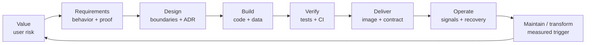

# Application Lifecycle and SDLC Drive-Through

API Observatory is easier to remember as a system that changes over time than as a list of
technologies. This guide follows the durable artifacts created from product idea through delivery,
operation, and evidence-driven transformation. In this solo project one maintainer owns all of the
concerns that a larger organization might distribute across roles.

The product example is a small SaaS application that depends on payment, authentication, email,
AI, or data APIs. The outcome is earlier evidence that a dependency is unavailable, slow, or
contract-incompatible. This is locally runnable portfolio evidence, not a claim of permanent
production operation.

## Lifecycle

## 1. Value

The smallest useful problem is not “build a distributed system.” It is “help a developer detect
and understand third-party API failure before users report it.” The resulting behavior is bounded:

- register an external API dependency;
- probe availability, latency, and response shape;
- group repeated failures into tenant-scoped incidents;
- show what changed and what needs attention;
- exclude billing, customer acquisition, permanent hosting, and speculative scale work.

See the [user guide](../09-user-guides/user-guide.md) for the operator-facing workflow.

## 2. Requirements and Planning

A change is planned as a vertical slice: `value → behavior → data → dependencies → failure → proof`.
For dependency incidents that means persisted state and ownership, tenant-safe API behavior,
deduplication under concurrent signals, bounded notification failure, telemetry, tests, and a
rollback-compatible migration.

The [current roadmap](../03-planning/mvp-roadmap.md) owns priorities and adoption triggers. It does
not reproduce transient project tracking.

## 3. Design

The ingestor owns the public API, scheduler, incidents, and optional agent. Inference is a separate
HTTP service with its own PostgreSQL database; the dashboard is a client; MCP is a local stdio
client. Significant choices are recorded in the [decision summary](../02-architecture/decisions.md)
and linked ADRs.

The repository boundary is also a contract:

| App repository | Infrastructure repository |
| --- | --- |
| Behavior, schemas, migrations, images, ports, health, local runtime, tests | Cloud IaC/state, IAM, networking, runtime secrets, deployment, platform monitoring |

Changes to ports, images, health endpoints, configuration names, ingress, IAM, secrets, or
telemetry must be checked against the app-owned
[deployment contract](../07-deployment/app-repo-contract.md).

## 4. Build

Implementation follows the slice through every affected layer rather than treating an endpoint as
the whole feature:

`migration → model/repository → service → authorization → API/UI → telemetry → documentation`

A schema change includes compatibility and rollback. A network call includes a timeout and failure
behavior. A cross-process schema includes contract versioning. Tenant isolation remains
deny-by-default. The [application architecture](../02-architecture/application-architecture.md)
maps these responsibilities to the current source tree.

## 5. Verify

- Unit tests prove deterministic behavior and failures.
- Integration tests prove database, migration, authorization, and service boundaries.
- Contract tests protect schemas and app/infra assumptions.
- Smoke, performance, and fault checks provide bounded runtime evidence.
- Security, dependency, image, and secret scans protect delivery inputs.

Passing configuration or a Terraform plan is not runtime proof. The statuses **Core**, **Lab**,
**Decision**, **Deferred**, and **Historical** keep claims honest. Use the
[development workflows](../05-development/dev-workflows.md),
[CI/CD reference](../06-ci-cd/ci-cd.md), and
[performance/failure worksheet](../05-development/performance-and-failure-lab.md) for proof.

## 6. Release and Delivery

Application CI validates all three deployable images without publishing them. After exact-commit
CI verification, manual CD builds immutable `tree-<SHA>` images for ingestor, inference, and
dashboard. Infrastructure supplies ECR, EC2, RDS, IAM, runtime values, and deployment mechanics.
MCP is excluded because it is a locally spawned stdio process.

AWS Stage 0 co-locates the three HTTP images on one EC2 Docker Compose platform. The contract is
documented and statically validated, but no live deployment is claimed. A real release requires
approval, health checks, migration compatibility, rollback proof, redacted evidence, and
cost-aware teardown. Continue with the app
[deployment contract](../07-deployment/app-repo-contract.md) and infra
[deployment guide](https://github.com/ivanprytula/api-observatory-infra/blob/main/docs/deployment/deployment-guide.md).

## 7. Operate

Operation needs health/readiness, structured logs, metrics, traces, alerts, persisted incident
state, and recovery procedures. The app defines signal meaning; infrastructure owns
production-oriented collection and routing. Current monitoring assets are local/configuration
evidence unless a live environment is separately exercised.

Start with [application observability](../08-operations/observability.md), then use the infra
[observability guide](https://github.com/ivanprytula/api-observatory-infra/blob/main/docs/operations/observability.md)
and recovery guide for platform actions.

## 8. Maintain and Transform

Maintenance covers dependency upgrades, security review, migrations, retention, backup/restore,
failure rehearsal, and removal of obsolete paths. Transformation changes a service boundary,
runtime, data strategy, or UI only after measured pressure.

1. Measure the user, reliability, capacity, ownership, or delivery problem.
2. Improve the current shape first when it can meet the target safely.
3. Record compatibility, rollback, and the rejected alternative.
4. Update both repositories when their contract moves.
5. Re-run behavior, failure, security, delivery, and recovery proof.

Valid triggers include repeated Compose deployment friction, independent workload scaling, a new
ownership boundary, a recovery objective beyond one region, or a measured database limit after
query/index/retention work. Technology interest alone is not a trigger.

## Interview Drive-Through

1. State the user problem and risk.
2. Trace one incident from requirement to data, API, UI, and telemetry.
3. Explain the app/infra boundary.
4. Show one test, one recovery path, and one immutable delivery contract.
5. Separate local runtime, labs, unexecuted AWS Stage 0, and deferred transformation.
6. End with the measurement that would justify the next architecture change.

The [interview package](interview-package.md) turns this lifecycle into a shorter live tour.
