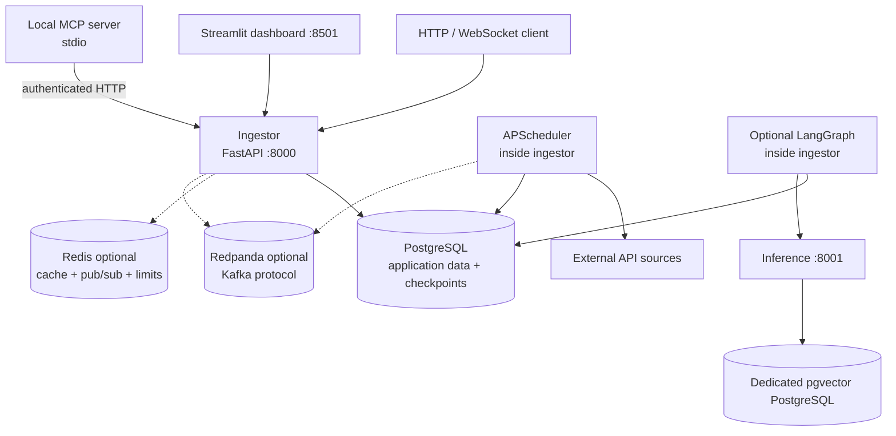
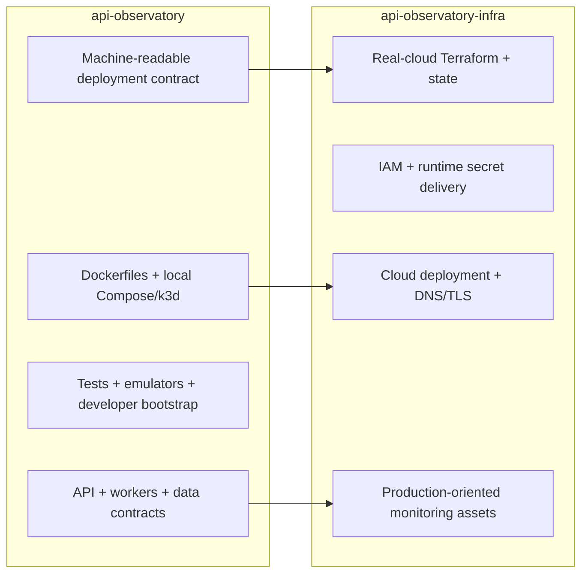

# Project Overview

API Observatory is a job-preparation playground for Python backend and distributed-systems
engineering. It uses a practical product frame—a solo SaaS developer monitoring third-party API
dependencies—so architecture exercises stay connected to user risk, operational cost, and failure
recovery.

## Purpose and Boundaries

The repository is intended to build and demonstrate the ability to:

- trace behavior across API, database, cache, broker, external service, and deployment boundaries;
- diagnose concurrency, consistency, performance, security, and reliability failures;
- select technology from evidence and explicit scale triggers;
- operate and roll back changes rather than only implement happy paths;
- explain the same decision at developer, senior, and lead levels.

It is not evidence of professional production ownership or a permanently operated SaaS. Local
execution, tests, manifests, Terraform plans, and temporary deployment evidence must be described
according to their actual status.

## Practical Value Example

The standing user is a solo SaaS developer whose application depends on payment, authentication,
email, AI, or data APIs.

| Question | Project behavior |
| --- | --- |
| Is the dependency reachable? | Scheduled health probes and persisted health samples |
| Is it becoming slower? | Rolling uptime/latency scorecards and SLO signals |
| Did its response shape break? | Schema fingerprints, compatibility scoring, and drift events |
| What should I investigate? | Deterministic operational evidence plus optional reviewed agent analysis |
| How do I receive changes? | Dashboard, WebSocket/pub-sub, and configured notification channels |

This context is an explanation layer. Billing, customer acquisition, permanent hosting, and broad
product growth are out of scope.

## Current Runtime

The ingestor and application PostgreSQL database form the core. Redis, Redpanda, inference, MCP,
monitoring, and AI features are optional or separately launched. The MCP process uses the public HTTP
contract; inference owns a separate database; the agent runs inside the ingestor and fails open when
its provider is unavailable.

See [Application Architecture](../02-architecture/application-architecture.md) for current router,
service, and dependency detail.

## Repository Ownership

Changes to ports, environment names, image names, health endpoints, IAM, ingress, secrets, or
observability must be checked against both repositories and the
[app/infra contract](../07-deployment/app-repo-contract.md).

## Source Layout

| Path | Current responsibility |
| --- | --- |
| `services/ingestor/` | FastAPI surface, scheduled probes, persistence, eventing, security, and optional agent |
| `services/dashboard/` | Streamlit client using the ingestor HTTP/WebSocket contracts |
| `services/inference/` | Embedding and vector-search API with dedicated pgvector PostgreSQL |
| `services/mcp/` | Local stdio MCP tools backed by authenticated ingestor HTTP calls |
| `libs/contracts/` | Versioned cross-process Pydantic contracts |
| `libs/platform/` | Shared logging, tracing, timeout, retry, breaker, and bulkhead primitives |
| `alembic/` | Application schema source of truth |
| `infra/` | Local Compose/k3d, emulators, monitoring, and sandbox infrastructure |
| `tests/`, `services/*/tests/` | Unit, integration, contract, failure, and end-to-end evidence |

## Core Data Model

- `User`, `UserTenant`, and `ApiKey` establish identity and tenant access.
- `SourceProfile` defines an external dependency and its probe cadence.
- `ProviderHealthSample` records reachability and latency evidence.
- `ContractSnapshot` and `DriftEvent` preserve response-shape history and compatibility changes.
- `Observation` is the general tenant-aware ingestion/incident record; `ObservationArchive` supports
  bounded retention.
- `ProcessedEvent`, `OutboxEvent`, and `InboxConsumption` demonstrate idempotent event delivery.
- `AgentRun` records optional checkpointed incident-triage work and human review.
- `SecurityAuditEvent` and `AbuseSignal` support security evidence and resolution workflows.

## Evidence Navigation

1. [Evergreen Engineering Topics](../02-architecture/engineering-topics.md) maps 20 concepts to
   current code, tests, failure modes, tradeoffs, and scale triggers.
2. [Technology Decisions](../02-architecture/decisions.md) indexes ADRs and rejected alternatives.
3. [MVP Roadmap](../03-planning/mvp-roadmap.md) distinguishes implemented and deferred features.
4. [Development Workflows](../05-development/dev-workflows.md) contains repeatable verification.
5. [User Guide](../09-user-guides/user-guide.md) explains the external workflow and API surface.

## Ownership Progression

For each engineering topic, progress through:

`Locate → Explain → Operate → Lead`

Catalogue coverage proves only discovery. Stronger evidence requires tracing, focused tests,
failure/recovery exercises, performance measurements, migrations, rollback, and defended tradeoffs.
