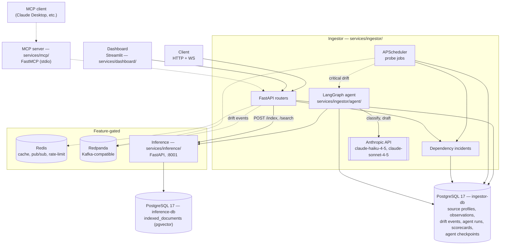
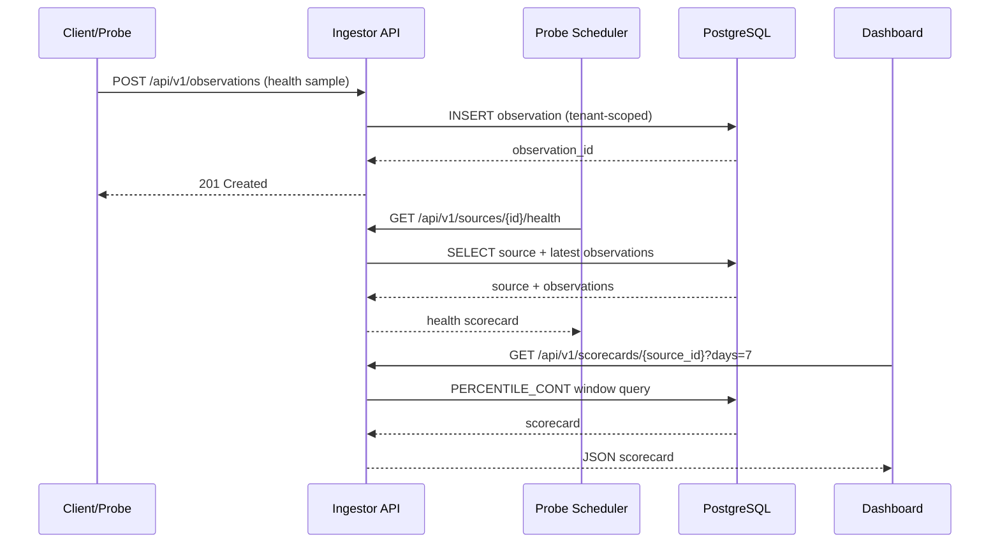
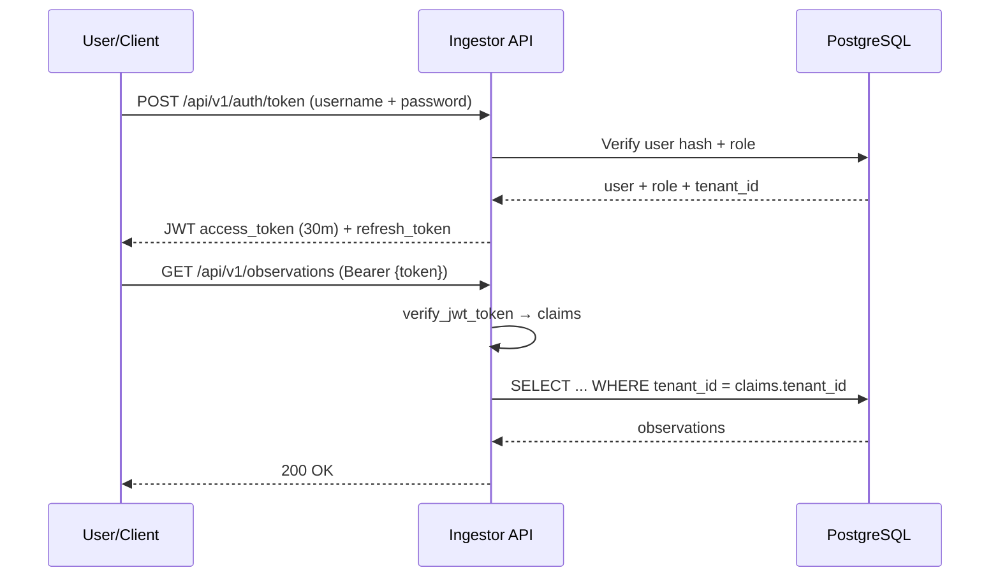
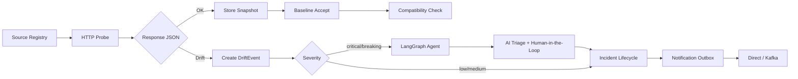
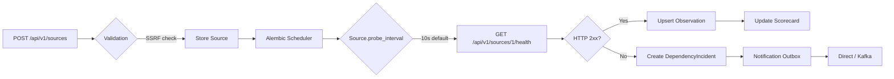

# Application Architecture — API Observatory

**Scope:** current application structure and deployable boundaries. The
[roadmap](../03-planning/mvp-roadmap.md) owns priorities, the
[engineering evidence map](engineering-topics.md) owns topic status, and the
[deployment contract](../07-deployment/app-repo-contract.md) owns the app/infra interface.

## Containers

Core, always-on: Ingestor + PostgreSQL. Cache and Broker are optional and feature-flagged
(`CACHE_ENABLED` / `BROKER_ENABLED`). Inference, the agent, and MCP are real
components; see the Containers diagram for their boundaries and ownership.

## Router / Feature Map

Routers live under `services/ingestor/api/routes/` — the source layout is canonical, not this map.
The table groups them by domain; per-router status and priority live in the
[evergreen engineering evidence map](engineering-topics.md), and the opt-in learning lab is
mounted only when `AUTH_DEMO_ROUTES_ENABLED=true`. Auth is JWT/API-key gated by default with role
guards applied where noted.

| Domain | Routers |
|---|---|
| Core data & contracts | `observations`/`observations_v2`, `scorecards`, `source_registry`, `contract_drift`, `incidents` |
| Authentication & identity | `auth`, `api_keys`, `abuse_detection` |
| Analytics, reporting, insights | `analytics`, `reporting`, `insights` |
| Alerting & delivery | `subscriptions`, `notifications` |
| Inference & agent | `vector_search` (RAG bridge to `inference`), `agent` (incident-triage HITL) |
| Realtime & ops | `ws` (WebSocket push), `health_ingestion_jobs` (probe/scheduler status), `background_processing` (task queue) |
| Tabular ETL | `etl` (optional `uv sync --extra etl`) |

`services/mcp/` has no FastAPI routers of its own — it's a separate process
(`services/mcp/server.py`) exposing MCP tools that call the routers above over real HTTP,
authenticated as a dedicated `mcp-service` account. See the Containers diagram above.

## Source and Data Ownership

| Path | Responsibility |
| --- | --- |
| `services/ingestor/` | API, scheduled probes, persistence, incidents, eventing, security, optional agent |
| `services/dashboard/` | Streamlit client over ingestor HTTP/WebSocket contracts |
| `services/inference/` | Embedding/vector-search API with dedicated pgvector PostgreSQL |
| `services/mcp/` | Local stdio tools backed by authenticated ingestor HTTP calls |
| `libs/contracts/` | Versioned cross-process Pydantic contracts |
| `libs/platform/` | Shared logging, tracing, timeout, retry, breaker, and bulkhead primitives |
| `alembic/` | Ingestor schema source of truth |

`User`, `UserTenant`, and `ApiKey` establish identity and tenant access. `SourceProfile` defines a
monitored dependency; health samples, contract snapshots, drift events, and dependency incidents
preserve its operational history. Outbox/inbox records protect event delivery, while `AgentRun`
stores optional checkpointed triage and human review.

The app repository owns these behaviors, contracts, migrations, images, and local runtime. The
sibling infrastructure repository owns real-cloud Terraform/state, IAM, networking, secret
delivery, deployment, and platform monitoring. Cross-repository changes follow the deployment
contract rather than duplicating topology documentation.

## How to Update

- **New service:** add the container and contract boundary, then update the deployment contract and
  applicable baseline controls in the same change.
- **New router or new domain:** add one group to the table above (or extend an existing group). No
  diagram edit needed unless it introduces a new external dependency (new datastore, new outbound
  integration).
- **Feature moves from deferred → active** (roadmap phase advances): update its status in the
  [evergreen engineering evidence map](engineering-topics.md).

## Data Flow Diagrams

### Core Observation Lifecycle

### Incident Lifecycle

The incident state machine (`open → acknowledged → resolved/closed`, re-open and quick-heal)
is canonical in the [dependency incident lifecycle](../08-operations/dependency-incidents.md#state-machine).
Deduplication keys on `source_id + incident_type + fingerprint`; RLS scopes to tenant, while
admins can read the global view.

### Auth Flow (JWT)

### Contract Drift Flow

### Source Registry & Probe Scheduling

