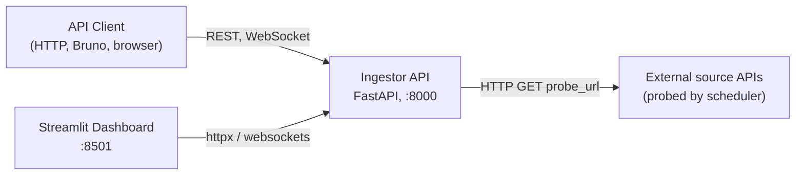
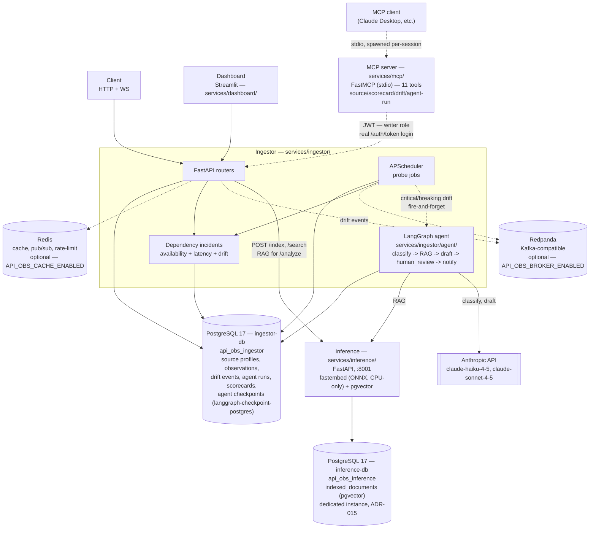
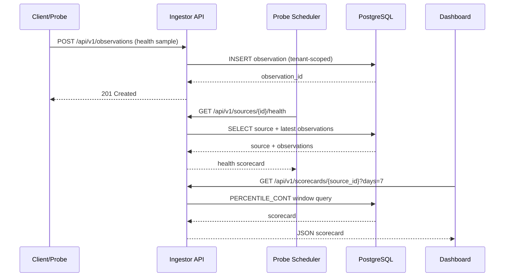
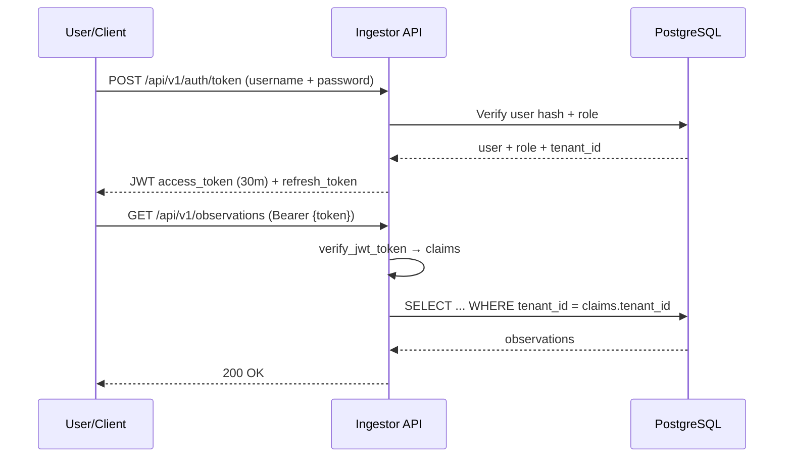
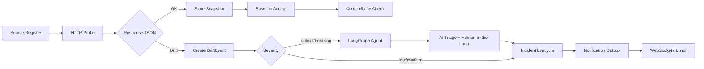

# Application Architecture — API Observatory

**Scope:** current application structure and deployable boundaries. The
[roadmap](../03-planning/mvp-roadmap.md) owns priorities, the
[engineering evidence map](engineering-topics.md) owns topic status, and the
[deployment contract](../07-deployment/app-repo-contract.md) owns the app/infra interface.

> An earlier, larger 8-phase design (multi-service, AWS ECS, MongoDB, Qdrant) is archived at
> `../_archive/02-architecture/architecture.md` — historical record, not current state.

## System Context



## Containers



Core, always-on: Ingestor + PostgreSQL. Cache and Broker are optional and feature-flagged
(`API_OBS_CACHE_ENABLED` / `API_OBS_BROKER_ENABLED`). Inference, the agent, and MCP are real
components; see the Containers diagram for their boundaries and ownership.

## Router / Feature Map

Router files under `services/ingestor/routers/`, grouped by MVP status. "Active" = mounted by
default and JWT-authenticated. The opt-in learning lab is mounted only when
`AUTH_DEMO_ROUTES_ENABLED=true`; unavailable dependencies remain unmounted.

| Router | Domain | Status |
|---|---|---|
| `agent.py` | Incident-triage agent run status + HITL resume (`GET /runs/{id}`, `POST /runs/{id}/resume`) | Active — real as of Phase 3, JWT-auth-gated as of Phase 4 |
| `source_registry.py` | Register/manage probed API sources | Active |
| `observations.py` / `observations_v2.py` | Probe results, ingestion | Active — core v1 CRUD/analyze routes use JWT plus a tenant/subject token bucket. The v2 and legacy v1 auth examples are opt-in learning routes. |
| `scorecards.py` | Reliability scorecards (p95 latency, uptime) | Active |
| `contract_drift.py` | Schema drift detection | Active |
| `incidents.py` | Tenant-scoped dependency incident lifecycle | Active — availability, latency, and breaking-drift triggers; operator acknowledge/resolve |
| `health_ingestion_jobs.py` | Scheduler/job health endpoints | Active |
| `auth.py` / `api_keys.py` | JWT auth, API key management | Active |
| `abuse_detection.py` | Rate-limit/abuse heuristics | Active |
| `ws.py` | WebSocket push (drift events) | Active |
| `analytics.py`, `reporting.py`, `insights.py` | Analytics/reporting layer | Active — JWT-authenticated; state-changing operations have role guards |
| `subscriptions.py`, `notifications.py` | Alerting channels | Active — JWT-authenticated; administrative operations have role guards |
| `vector_search.py` | RAG bridge to the `inference` service (`/index`, `/search`) | Active — `inference` is real as of Phase 2 (pgvector, no Qdrant) |
| `mongo_analytics.py` | Document store | Unmounted unless Mongo is explicitly enabled and available |
| `scraper.py` | HTTP/HTML/browser scraping | Unmounted unless Mongo is explicitly enabled and available |
| `etl.py` | Tabular ETL preview (pandas/polars) | Active with writer-or-higher JWT role; requires `uv sync --extra etl` |
| `background_processing.py` | Async task queue prototype | Active with administrative JWT role |

`services/mcp/` (Phase 5) has no FastAPI routers of its own — it's a separate process
(`services/mcp/server.py`) exposing 11 MCP tools that each call the routers above over real HTTP,
authenticated as a dedicated `mcp-service` account. See the Containers diagram above.

## Source and Data Ownership

| Path | Responsibility |
| --- | --- |
| `services/ingestor/` | API, scheduled probes, persistence, incidents, eventing, security, optional agent |
| `services/dashboard/` | Streamlit client over ingestor HTTP/WebSocket contracts |
| `services/inference/` | Embedding/vector-search API with dedicated pgvector PostgreSQL |
| `services/mcp/` | Local stdio tools backed by authenticated ingestor HTTP calls |
| `libs/contracts/` | Versioned cross-process Pydantic contracts |
| `libs/platform/` | Shared logging, tracing, timeout, retry, breaker, and bulkhead primitives |
| `alembic/` | Ingestor schema source of truth |

`User`, `UserTenant`, and `ApiKey` establish identity and tenant access. `SourceProfile` defines a
monitored dependency; health samples, contract snapshots, drift events, and dependency incidents
preserve its operational history. Outbox/inbox records protect event delivery, while `AgentRun`
stores optional checkpointed triage and human review.

The app repository owns these behaviors, contracts, migrations, images, and local runtime. The
sibling infrastructure repository owns real-cloud Terraform/state, IAM, networking, secret
delivery, deployment, and platform monitoring. Cross-repository changes follow the deployment
contract rather than duplicating topology documentation.

## How to Update

- **New service:** add the container and contract boundary, then update the deployment contract and
  applicable baseline controls in the same change.
- **New router**: add one row to the table above. No diagram edit needed unless it introduces
  a new external dependency (new datastore, new outbound integration).
- **Feature moves from deferred → active** (roadmap phase advances): flip its Status cell and
  drop the "why deferred" note.

## Data Flow Diagrams

### Core Observation Lifecycle



### Incident Lifecycle

```mermaid
stateDiagram-v2
    [*] --> Open: Health sample breaches SLO
    Open --> Acknowledged: Admin /api/v1/incidents/{id}/acknowledge
    Acknowledged --> Resolved: Auto/heal /api/v1/incidents/{id}/resolve
    Resolved --> Closed: Retention window expires
    Open --> Resolved: Quick heal
    Acknowledged --> Open: Re-open if still breaching

    note right of Open: Deduplication key = source_id + incident_type + fingerprint
    note right of Resolved: RLS scopes to tenant; admin can read global
```



### Auth Flow (JWT)



### Contract Drift Flow



### Source Registry & Probe Scheduling

```mermaid
flowchart LR
    A[POST /api/v1/sources] --> B{Validation}
    B -->|SSRF check| C[Store Source]
    C --> D[Alembic Scheduler]
    D --> E{Source.probe_interval}
    E -->|10s default| F[GET /api/v1/sources/{id}/health]
    F --> G{HTTP 2xx?}
    G -->|Yes| H[Upsert Observation]
    G -->|No| I[Create DependencyIncident]
    H --> J[Update Scorecard]
    I --> K[WebSocket Notification]
```
