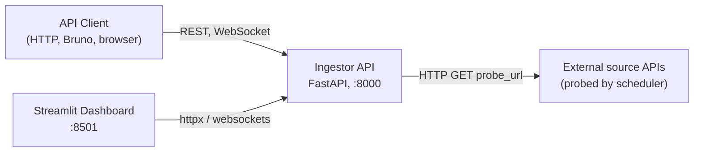
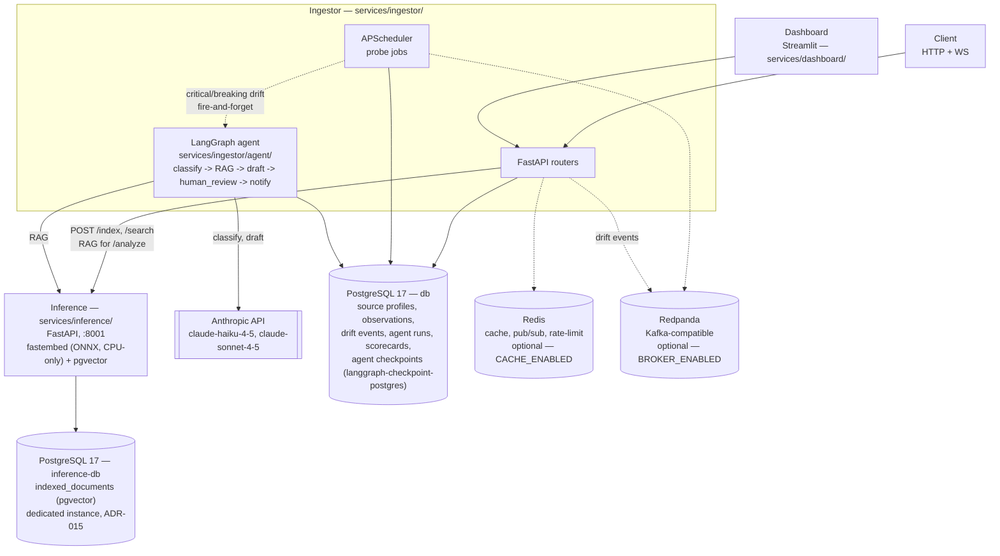

# Application Architecture — API Observatory

**Scope**: Current MVP state (application repo only). For platform/infra topology, see
[Infrastructure Architecture](infrastructure-architecture.md). For phase-by-phase feature
status, see [MVP Roadmap](../03-planning/mvp-roadmap.md) and its
[audit-gaps](../03-planning/audit-gaps.md) tracker — this document shows structure, those
track status.

> An earlier, larger 8-phase design (multi-service, AWS ECS, MongoDB, Qdrant) is archived at
> `../_archive/02-architecture/architecture.md` — historical record, not current state.

## System Context

## Containers

Core, always-on: Ingestor + PostgreSQL. Cache and Broker are optional and feature-flagged
(`CACHE_ENABLED` / `BROKER_ENABLED`) — the ingestor fails open if either is unavailable.
Inference is real as of Phase 2 of the AI-augmented observatory plan; per
[ADR 015](adr/015-inference-dedicated-pgvector-postgres.md) it runs on its own dedicated Postgres
instance (`inference-db`), not the ingestor's `db` — real per-service database ownership, not just
schema-level separation. The ingestor never reads inference's tables directly, only via the
`/index` and `/search` HTTP contract in `services/ingestor/vector_search.py`.
The LangGraph incident-triage agent (Phase 3) runs *inside* the ingestor process (not a separate
container) — fire-and-forget triggered by `contract_drift.py` on critical/breaking `DriftEvent`s,
checkpointed to the same `db` Postgres via `langgraph-checkpoint-postgres` so the human-in-the-loop
pause/resume survives process restarts. Fails open like everything else here: with no
`ANTHROPIC_API_KEY` configured, drift detection and every other feature works exactly the same,
the agent trigger just no-ops (`services/ingestor/agent/runner.py`).

## Router / Feature Map

Router files under `services/ingestor/routers/`, grouped by MVP status. "Active" = in MVP
scope, tested, auth-gated where applicable. "Present, deferred" = code exists but the feature
is explicitly out of MVP scope per the roadmap (`audit-gaps.md` gap 🟠#6) and currently has no
auth applied.

| Router | Domain | Status |
|---|---|---|
| `agent.py` | Incident-triage agent run status + HITL resume (`GET /runs/{id}`, `POST /runs/{id}/resume`) | Active — real as of Phase 3, no auth yet (Phase 4) |
| `source_registry.py` | Register/manage probed API sources | Active |
| `observations.py` / `observations_v2.py` | Probe results, ingestion | Active |
| `scorecards.py` | Reliability scorecards (p95 latency, uptime) | Active |
| `contract_drift.py` | Schema drift detection | Active |
| `health_ingestion_jobs.py` | Scheduler/job health endpoints | Active |
| `auth.py` / `api_keys.py` | JWT auth, API key management | Active |
| `abuse_detection.py` | Rate-limit/abuse heuristics | Active |
| `ws.py` | WebSocket push (drift events) | Active |
| `analytics.py`, `reporting.py`, `insights.py` | Analytics/reporting layer | Present, deferred (post-MVP) |
| `subscriptions.py`, `notifications.py` | Alerting channels | Present, deferred (post-MVP) |
| `vector_search.py` | RAG bridge to the `inference` service (`/index`, `/search`) | Active — `inference` is real as of Phase 2 (pgvector, no Qdrant) |
| `mongo_analytics.py` | Document store | Present, deferred — no MongoDB in `docker-compose.yml` |
| `scraper.py` | HTTP/HTML/browser scraping | Present, deferred (post-MVP) |
| `etl.py` | Tabular ETL preview (pandas/polars) | Present, optional extras only (`uv sync --extra etl`) |
| `background_processing.py` | Async task queue prototype | Present, deferred (post-MVP) |

## How to Update

- **New service** (e.g. a real `analytics` or `inference` service gets source code): add a
  container node to the Containers diagram, add a row to the Router/Feature Map if it exposes
  routers, and follow the CLAUDE.md "Plan Maintenance" trigger (update `app-repo-contract.md` + baseline checklist in the same PR).
- **New router**: add one row to the table above. No diagram edit needed unless it introduces
  a new external dependency (new datastore, new outbound integration).
- **Feature moves from deferred → active** (roadmap phase advances): flip its Status cell and
  drop the "why deferred" note.
