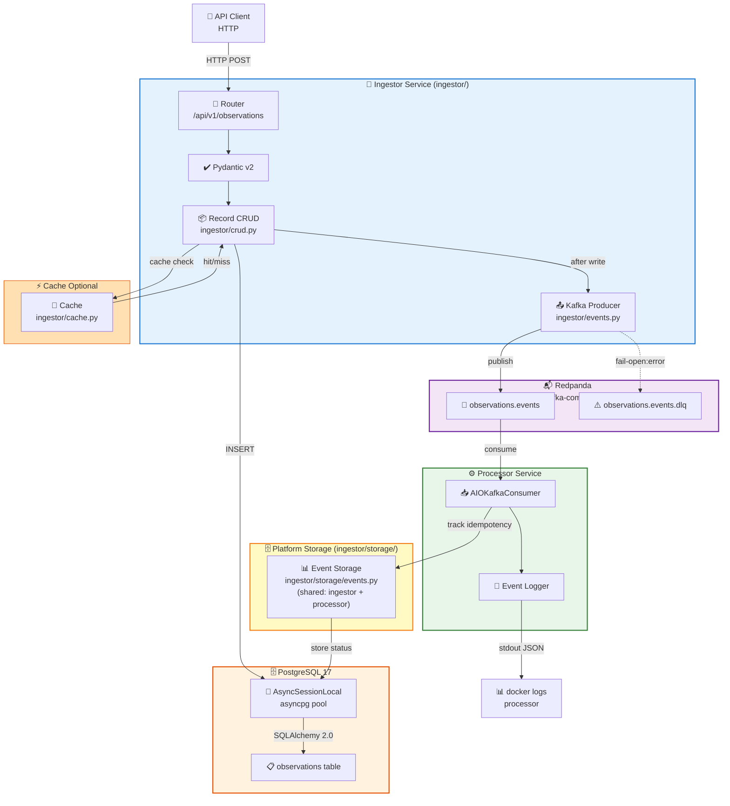
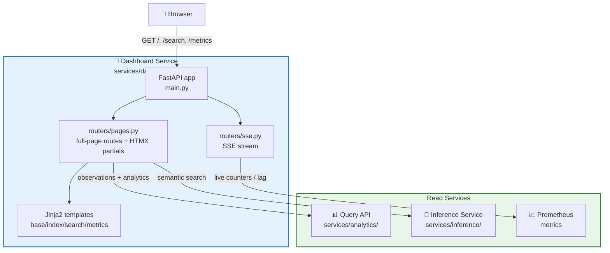
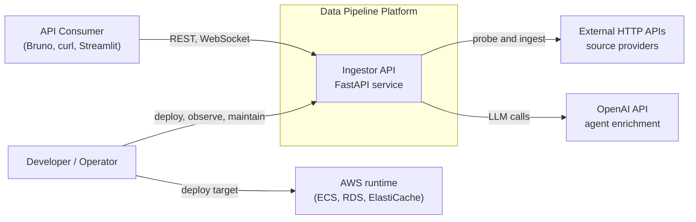
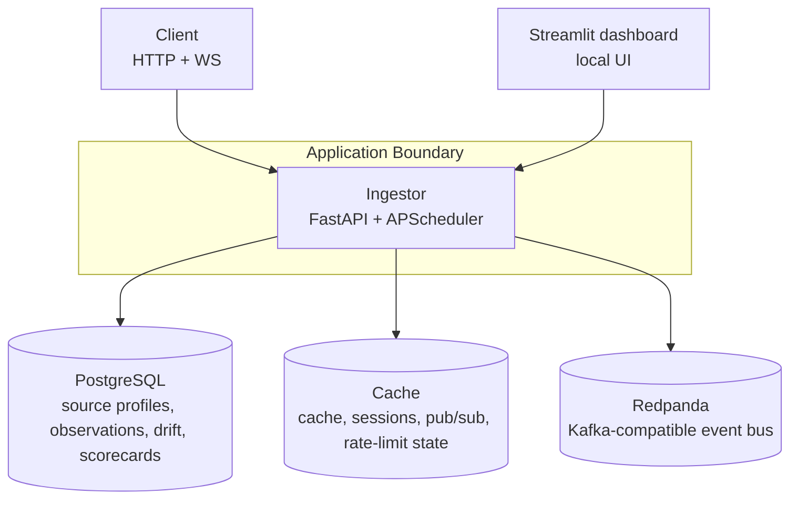
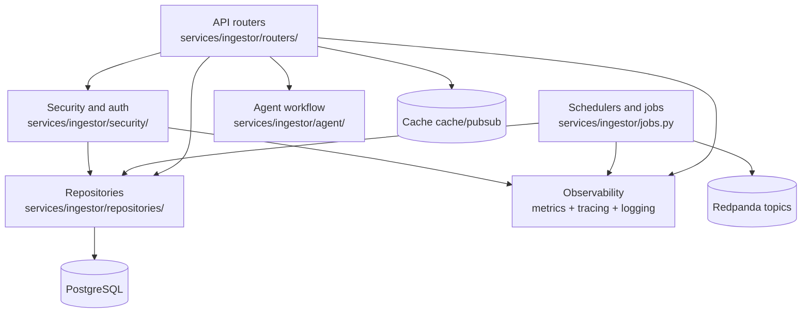

# System Architecture — Data Zoo Platform

> **Long-Term Vision** — Describes the end-state Phase 0–8 architecture across multiple services. For the current MVP (Phase 1–3, single-service ingestor), see the Architecture Overview.

Track: C — Architecture and Platform Strategy

**Last Updated**: April 23, 2026
**Scope**: Phase 0 (Foundation) → Phase 8 (Production)
**Status**: Active Implementation (Phases 1-5 partially implemented)

---

## Current Implementation Snapshot (April 2026)

- Primary API package is `ingestor/`, and path naming in this document is aligned to that package.
- Pillar 3 scheduling is implemented with APScheduler and health endpoints:
  - `GET /health/jobs-metrics`
  - `GET /health/jobs/{job_name}-metrics`
- Pillar 4 observability is implemented:
  - structured logging + correlation IDs
  - Prometheus metrics (`/metrics`)
  - OpenTelemetry tracing (Jaeger/OTLP)
- Pillar 5 background processing now includes an in-process worker queue prototype:
  - `POST /api/v1/background/ingest/batch`
  - `GET /api/v1/background/tasks/{task_id}`
  - `GET /api/v1/background/workers/health`
  - feature flags: `BACKGROUND_WORKERS_ENABLED`, `BACKGROUND_WORKER_COUNT`, `BACKGROUND_WORKER_QUEUE_SIZE`, `BACKGROUND_MAX_TRACKED_TASKS`
- Pillar 8 notifications and emailing baseline is implemented:
  - notification abstraction in `ingestor/notifications.py`
  - channels: Slack, Telegram, webhook (Jira automation), email (Resend)
  - test dispatch endpoint: `POST /api/v1/notifications/test`
  - background task failure alerts routed through the notification service
- Sentry baseline is integrated for centralized exception tracking:
  - startup integration via `ingestor/core/sentry.py`
  - env flags: `SENTRY_ENABLED`, `SENTRY_DSN`

### Pillar 5 Runtime Flow (Current Prototype)

```text
Client
  |
  | POST /api/v1/background/ingest/batch
  v
Background Router
  |
  | enqueue task_id + payload
  v
BackgroundWorkerPool (asyncio.Queue)
  |
  | consumed by N async workers
  v
jobs.ingest_api_batch(...)
  |
  v
Task Status Store (in-memory) + Prometheus metrics
  |
  | GET /api/v1/background/tasks/{task_id}
  v
Client polls terminal state: succeeded | failed | cancelled
```

---

## Monorepo Target Structure (Phases 0–8)

```text
api-observatory/
├── ingestor/                          (Phase 1+: Ingestor service)
│   ├── main.py
│   ├── crud.py                   (Ingestor-specific CRUD: Record operations)
│   ├── models.py
│   ├── schemas.py
│   ├── events.py                 (← Phase 1: Kafka producer singleton)
│   ├── routers/
│   ├── scrapers/                 (← Phase 2: Scraper implementations)
│   ├── storage/                  (← Platform-wide storage layer)
│   │   ├── __init__.py
│   │   ├── events.py             (← Phase 1: ProcessedEvent CRUD for event tracking)
│   │   └── mongo.py              (← Phase 2: MongoDB client)
│   └── core/circuit_breaker.py    (← Phase 4: Resilience patterns)
│
├── services/                      (← Phase 1+: New microservices)
│   ├── processor/                 (Phase 1: Kafka consumer)
│   ├── inference/               (Phase 3: Embeddings + Qdrant)
│   ├── analytics/                (Phase 5: Analytics + CQRS)
│   └── dashboard/                (Phase 6: HTMX + Jinja2 + SSE dashboard)
│
├── infra/
│   ├── terraform/                (← Phase 7: IaC for AWS)
│   ├── monitoring/               (← Phase 8: Prometheus + Grafana)
│   ├── scripts/
│   │   ├── backup.sh             (← Phase 8)
│   │   └── chaos.sh              (← Phase 8)
│   └── database/
│
├── docs/
│   ├── adr/                       (← Phase 0: ADR stubs)
│   │   ├── 001-kafka-vs-rabbitmq.md
│   │   ├── 002-qdrant-vs-pgvector.md
│   │   └── 003-htmx-vs-react.md  →  docs/02-architecture/adr/003-htmx-vs-react.md
│   ├── architecture.md            (← This file, monorepo target structure)
│   ├── pillar-*.md               (Consolidated domain knowledge)
│   └── decisions.md              (Tech choice trade-off reasons)
│
├── learning_docs/
│   └── ACTION_PLAN.md            (← Phase 0: 8-week execution roadmap)
│
├── .github/
│   ├── instructions/             (8 phase guides + templates)
│   ├── prompts/
│   │   ├── plan-dataZooScaffolding.prompt.md
│   │   └── plan-dataZooPlatform.prompt.md
│   └── workflows/
│
├── docker-compose.yml            (← Evolves per phase)
├── pyproject.toml                (← Evolves per phase)
└── README.md
```

---

## Phase Progression

| Phase | Focus                     | Services            | Components Added                                                          |
| ----- | ------------------------- | ------------------- | ------------------------------------------------------------------------- |
| **0** | Docs & Planning           | —                   | ADRs, architecture, ACTION_PLAN, monorepo structure                       |
| **1** | Event Streaming           | ingestor, processor | Redpanda, Kafka producer/consumer, fail-open events                       |
| **2** | Data Scraping             | + scrapers          | HTTP/HTML/browser scrapers, MongoDB client                                |
| **3** | AI + Vector DB            | inference           | Qdrant, sentence-transformers, embeddings                                 |
| **4** | Resilience Patterns       | processor (updated) | Circuit breaker, DLQ, OpenTelemetry, Jaeger                               |
| **5** | Background Workers + CQRS | ingestor, analytics | In-process worker queue prototype, task status APIs, analytics read layer |
| **6** | Dashboard                 | dashboard           | HTMX, Jinja2, SSE, backend-rendered UI                                    |
| **7** | Cloud Deployment ✅       | (all services)      | Terraform, AWS ECS Fargate, RDS, MSK, ElastiCache                         |
| **8** | Production Hardening      | (all services)      | Prometheus, Grafana, backups, chaos testing                               |

---

## High-Level Data Flow (Through Pillar 8 Notifications & Emailing)

```mermaid
graph TB
    Client["👤 API Client (HTTPS)"]
    ALB["⚡ AWS Application<br/>Load Balancer"]

    subgraph Compute["AWS ECS Fargate"]
        Ingestor["📝 Ingestor<br/>(ingestor/)"]
        Scraper["🕷️ Scraper<br/>(Phase 2)"]
        Processor["⚙️ Processor<br/>(services/)"]
        AIGateway["🤖 Inference Service<br/>(embeddings)"]
        QueryAPI["📊 Query API<br/>(analytics)"]
        Dashboard["🎨 Dashboard<br/>(HTMX + Jinja2)"]
      Notifier["🔔 Notification Service<br/>(ingestor/notifications.py)"]
    end

    subgraph Data["AWS Data Layer"]
        RDS["🗄️ PostgreSQL 17<br/>(RDS)"]
        MongoDB["📚 MongoDB<br/>(document store)"]
        Qdrant["🔍 Qdrant<br/>(vector DB)"]
        Cache["⚡ Cache<br/>(ElastiCache)"]
    end

    subgraph Messaging["AWS MSK<br/>(Kafka)"]
        Topics["📬 Topics<br/>observations.events<br/>observations.events.dlq"]
    end

    subgraph Observability["Observability"]
        Prometheus["📈 Prometheus"]
        Grafana["📊 Grafana"]
        Jaeger["🔍 Jaeger"]
      Sentry["🚨 Sentry"]
    end

    subgraph Notifications["Team Notifications"]
      Slack["💬 Slack"]
      Telegram["📲 Telegram"]
      Jira["📌 Jira Automation<br/>(webhook)"]
      Resend["✉️ Resend Email"]
    end

    Client -->|HTTPS| ALB
    ALB --> Ingestor
    ALB --> Dashboard
    Ingestor -->|publish| Topics
    Ingestor -->|write| RDS
    Ingestor -->|cache| Cache
    Topics -->|consume| Processor
    Processor -->|embed| AIGateway
    Processor -->|store| Qdrant
    Processor -->|log errors| Topics
    AIGateway -->|store| Qdrant
    QueryAPI -->|read analytics| RDS
    QueryAPI -->|listen| Topics
    Dashboard -->|query| QueryAPI
    Dashboard -->|search| AIGateway
    Ingestor -->|failure alert event| Notifier
    Notifier -->|send| Slack
    Notifier -->|send| Telegram
    Notifier -->|webhook| Jira
    Notifier -->|email| Resend
    Ingestor -->|metrics| Prometheus
    Processor -->|metrics| Prometheus
    QueryAPI -->|metrics| Prometheus
    Prometheus -->|visualize| Grafana
    Ingestor -->|trace| Jaeger
    Processor -->|trace| Jaeger
    Ingestor -->|exceptions| Sentry
    Notifier -->|provider failures| Sentry
    Sentry -->|alerts (optional)| Slack

    style Compute fill:#e3f2fd,stroke:#1976d2
    style Data fill:#fff3e0,stroke:#e65100
    style Messaging fill:#f3e5f5,stroke:#6a1b9a
    style Observability fill:#e8f5e9,stroke:#2e7d32
    style Notifications fill:#fff8e1,stroke:#f9a825
```

---

## Phase 0: Docs Consolidation (Foundation)

**Goal**: Establish single source of truth before any Phase 1 code.

### Architecture Goals

1. **Monorepo structure** — clearly separates services and shared code
2. **ADR-driven decisions** — all major choices documented with trade-offs
3. **Consolidated docs** — `docs/02-architecture/pillars/pillar-*.md` own one domain each; no duplication
4. **Execution roadmap** — `learning_docs/ACTION_PLAN.md` maps 8 phases to 16 weeks

### Key Files Created

- [ADR 001: Kafka vs RabbitMQ](adr/001-kafka-vs-rabbitmq.md) — Why Redpanda + Kafka API
- [ADR 002: Qdrant vs pgvector](adr/002-qdrant-vs-pgvector.md) — Why Qdrant primary, pgvector secondary
- ADR 003 (HTMX vs React) — Why HTMX + backend templates (Phase 6)
- This file: `docs/02-architecture/architecture.md` — Monorepo target + data flow diagrams

---

## Phase 1: Event-Driven Architecture (Current State)



Phase 1 Flows:

- **Ingest**: POST `/api/v1/observations` → validate → store in PostgreSQL → publish Kafka event
- **Event**: Redpanda topic receives `{observation_id, source}` payload
- **Consume**: Processor subscribes, logs each event to stdout
- **Fail-open**: If Kafka unavailable, request still succeeds (warning logged, event lost)
- **Cache** (optional): Cache for read-through caching
- **DLQ**: Failed messages route to dead letter queue for replay

## Components

### 🔀 FastAPI Application Layer

**Location**: \`ingestor/main.py\`, \`ingestor/routers/\`

Responsibilities:

- HTTP endpoint routing (\`/api/v1/observations/*\`)
- Request validation via Pydantic v2
- Dependency injection (database sessions, logging)
- Error handling & HTTP exceptions
- Correlation ID propagation

### 📦 CRUD Layer

**Location**: \`ingestor/crud.py\`

Responsibilities:

- Pure async database operations
- SQLAlchemy 2.0 ORM queries (\`select()\`, \`insert()\`, \`update()\`)
- Session lifecycle management
- Transaction handling (\`commit/rollback\`)

Key Pattern:
\`\`\`python
async def get_observation(db: AsyncSession, observation_id: int) -> Record | None:
    result = await db.execute(select(Record).where(Record.id == observation_id))
    return result.scalar_one_or_none()
\`\`\`

### 🗄️ PostgreSQL + asyncpg

**Location**: \`ingestor/database.py\`

Configuration:

- \`pool_size=5\`: Connections in pool
- \`max_overflow=10\`: Extra connections under load
- \`expire_on_commit=False\`: Keep ORM objects after commit (CRITICAL!)

### 🏷️ Correlation ID Tracing

**Location**: \`ingestor/core/logging.py\`

Tracks requests end-to-end via ContextVar, injected into every log.

### 📤 Kafka Producer (Phase 1)

**Location**: `ingestor/events.py`

Responsibilities:

- Singleton AIOKafkaProducer connected in `ingestor/main.py` lifespan
- `publish_observation_created(observation_id, payload)` — publishes to `observations.events` topic
- Fail-open: logs KafkaError but doesn't crash the request
- Generic type: `EventPayload[T]` for typed event payloads

Key Pattern:

```python
async def publish_observation_created(observation_id: int, payload: dict) -> None:
    """Publish observation creation event to Kafka (fail-open)."""
    if _producer is None:
        return  # Not connected; silently skip
    try:
        value = json.dumps({"observation_id": observation_id, **payload}).encode()
        await _producer.send_and_wait("observations.events", value=value)
    except KafkaError as exc:
        logger.warning("kafka_publish_failed", extra={"error": str(exc)})
        # Don't crash; events are best-effort observability
```

### 📊 Event Storage Layer (Platform-Wide) — Phase 1+

**Location**: `ingestor/storage/events.py`

Why it exists: Processor needs to track consumed events with **industry-standard patterns**:

- **Idempotency**: Duplicate messages don't cause double-processing
- **Status tracking**: Event moves pending → processing → completed/failed/dead_letter
- **DLQ routing**: Failed events persist for later replay/inspection
- **Offset tracking**: Kafka offset stored for recovery after crashes
- **Batch efficiency**: Bulk-insert via INSERT...RETURNING (single round-trip)

**Shared by**: Both ingestor service and processor service (decoupled from `ingestor/crud.py` which is ingestor-specific)

Core Functions:

```python
# Deduplication on consume
event, created = await create_processed_event(
    db,
    kafka_topic="observations.events",
    kafka_partition=0,
    kafka_offset=1234,
    idempotency_key="uuid-of-event",  # Unique per event
    event_type="observation.created",
    payload={"observation_id": 42, "source": "api"}
)
# If same idempotency_key arrives twice: created=False (duplicate ignored)

# Track processing state
await mark_event_processing(db, event.id)   # pending → processing
await mark_event_completed(db, event.id)     # processing → completed ✓
await mark_event_failed(db, event.id, "timeout error", {"stack": "..."})  # → failed
await mark_event_dlq(db, event.id, "max retries exceeded")  # → dead_letter (human inspection)
```

**ORM Model**: `ingestor/models.py::ProcessedEvent` with fields:

- `kafka_topic`, `kafka_partition`, `kafka_offset` — Kafka metadata
- `idempotency_key` — unique per event (prevents double-processing)
- `status` — pending | processing | completed | failed | dead_letter
- `payload` — JSON event data
- `error_message`, `error_details` — full context if failed
- `dead_letter_queue` — boolean flag for DLQ routing
- `processing_attempts` — retry count
- `processed_at` — completion timestamp (via TimestampMixin)

### 📥 Kafka Consumer (Phase 1)

**Location**: `services/processor/main.py`

Responsibilities:

- Runs as standalone service in Docker
- Subscribes to `observations.events` topic with group `processor-group`
- Retry loop on startup (waits for Redpanda leader election)
- Logs each event as JSON to stdout
- Handles malformed messages gracefully

See `Justfile` for compose commands to run individual services.

### 📊 Environment-Aware Logging

Development:

```text
2026-04-16 11:18:05 | INFO | ingestor/routers/observations.py:45:create_observation | [cid-123] observation created
```

Production:

```json
{"message": "observation_created", "user_id": 42, "cid": "cid-123"}
```

### 🧪 Testing Pyramid

- **Unit**: Isolated functions (5+ tests)
- **Integration**: Components together with aiosqlite (20 tests)
- **E2E**: Full HTTP roundtrip with AsyncClient (20 tests)

## How to Update This Diagram

1. Edit this file (\`docs/02-architecture/architecture.md\`)
2. Modify Mermaid syntax
3. Commit and push (use your preferred git workflow)
4. GitHub auto-renders the diagram
5. Team reviews in PR before merging

## Phase 1 Design Patterns

### Observer Pattern — Event Publishing

When a observation is created, the ingestor publishes an event without coupling to the processor:

```text
Record created → Kafka event → Processor consumes asynchronously
↑
No tight dependency between ingestor and processor
```

Benefits:

- Processor can be down; ingestor still works (fail-open)
- Multiple consumers can process same event (add more services later)
- Decoupled: ingestor doesn't care if processor succeeds/fails

### TypeVar + Generic — Typed Event Payloads

```python
from typing import Generic, TypeVar

T = TypeVar('T')

class EventPayload(Generic[T]):
    """Future: extend for strongly-typed event schemas."""
    observation_id: int
    data: T  # Can be any type: dict, RecordData, etc.
```

This prepares for Phase 2+ when we add scrapers with different payload types.

---

## Phase 2: Data Scraping with Multi-Protocol Support (Current Implementation)

**Status**: ✅ Complete — Scrapers + MongoDB + Kafka event integration
**Timeline**: Week 3–4 (April 2026)

### Architecture

```mermaid
graph TB
    Client["👤 API Client<br/>HTTP"]

    subgraph Ingestor["📝 Ingestor (ingestor/)"]
        RecordsRouter["🔀 Records Router<br/>/api/v1/observations"]
    end

    subgraph Scrapers["🕷️ Scraper Service (ingestor/routers/scraper.py)"]
        ScraperRouter["POST /api/v1/scrape/{source}"]
        Factory["🏭 ScraperFactory"]
        HTTPScraper["HTTPScraper<br/>(httpx)"]
        HTMLScraper["HTMLScraper<br/>(BeautifulSoup)"]
        BrowserScraper["BrowserScraper<br/>(Playwright)"]
    end

    subgraph Storage["🗄️ Storage Layer (ingestor/storage/)"]
        Mongo["📚 Motor Async<br/>MongoDB client"]
        Cache["💾 Cache Optional"]
    end

    subgraph Events["📤 Event Publishing (ingestor/events.py)"]
        KafkaProducer["Kafka Producer<br/>publish_doc_scraped()"]
    end

    subgraph Data["Data Persistence"]
        MongoDB_DB["🗄️ MongoDB<br/>(Document store)"]
        RDS["🗄️ PostgreSQL<br/>(Structured data)"]
        Kafka["📬 Redpanda<br/>(Event stream)"]
    end

    Client -->|POST /api/v1/scrape/...| ScraperRouter
    ScraperRouter --> Factory
    Factory -->|REST API| HTTPScraper
    Factory -->|HTML Parse| HTMLScraper
    Factory -->|Browser| BrowserScraper

    HTTPScraper -->|Semaphore(5)<br/>Exponential backoff| Cache
    HTMLScraper -->|Parse HTML| Cache
    BrowserScraper -->|JS rendering| Cache

    HTTPScraper -->|Fail-open| Mongo
    HTMLScraper -->|Fail-open| Mongo
    BrowserScraper -->|Fail-open| Mongo

    Mongo -->|insert_many| MongoDB_DB
    KafkaProducer -->|Async<br/>Fire-and-forget| Kafka
    ScraperRouter -->|Always 200| KafkaProducer

    RDS -.->|Optional analytics| ScraperRouter

    style Scrapers fill:#fff9c4,stroke:#f57f17,stroke-width:2px
    style Storage fill:#ffe0b2,stroke:#e65100,stroke-width:2px
    style Data fill:#f3e5f5,stroke:#6a1b9a,stroke-width:2px
```

### Components

**🏭 ScraperFactory** (`ingestor/scrapers/__init__.py`)

- Dispatches requests to appropriate scraper type
- Pattern: Uniform interface, 3 implementations
- `get_scraper(source: str) -> Scraper`

📡 HTTPScraper

- Uses `httpx.AsyncClient` for REST APIs
- Example: JSONPlaceholder (demo API)
- Features: Exponential backoff (3 retries), timeout (10s), async concurrency

🔍 HTMLScraper

- Uses BeautifulSoup + httpx for HTML parsing
- Example: Hacker News front page
- Features: CSS selector queries, lightweight

🌐 BrowserScraper

- Uses Playwright for JS-rendered content
- Example: Pages requiring browser automation
- Features: Full browser automation, JavaScript execution, cookies/auth

📚 Motor Async MongoDB

- Singleton pattern (ingestor/storage/mongo.py)
- Collection: `scraped` — immutable log of scraped documents
- Fail-open: Errors logged, endpoint still returns 200
- Documents: `{url, title, content, source, created_at, updated_at}`

**📊 ScrapeResponse** (`ingestor/schemas.py`)

```python
class ScrapeResponse(BaseModel):
    source: str
    items_scraped: int       # Documents fetched
    items_stored: int        # Successfully persisted to MongoDB
    duration_ms: int         # Total time (scrape + storage)
    event_published: bool    # Kafka event published?
```

#### 📤 Kafka Event: `doc.scraped`

- Published after **every** scrape (success or partial failure)
- Payload: `{source, count, timestamp}`
- Downstream: Processor can track scrape lag, trigger indexing, etc.
- Async fire-and-forget (errors logged, doesn't block response)

### Design Principles (Phase 2)

1. Fail-Open Architecture
   - If MongoDB unavailable → endpoint returns 200 (items_stored=0, error logged)
   - If Kafka unavailable → endpoint returns 200 (event_published=false, error logged)
   - Rationale: Don't cascade failures; user gets feedback; data can be replayed from logs
2. Concurrency Safety with Semaphore
   - `Semaphore(5)` by default (configurable per source)
   - Prevents: Bot bans, rate limiting, connection exhaustion
   - Improves: Observability (easier to debug with 5 vs 100 concurrent)
3. Configurable Resilience

    ```python
    # ingestor/config.py
    SCRAPER_TIMEOUTS = {
        "jsonplaceholder": 10,
        "hn": 15,
        "playwright": 30  # Browser slower
    }
    SEMAPHORE_LIMITS = {
        "jsonplaceholder": 10,  # More aggressive safe
        "hn": 5,                # Conservative
        "playwright": 3         # Heavy on resources
    }
    ```

4. Observable Failures

  ```python
  logger.error("scrape_failed, extra={
      "source": source,
      "duration_ms": duration,
      "error_type": type(e).__name__,
      "count_attempted": len(items),
      "count_stored": stored_count
    })
  ```

### Data Flows

Happy Path:

```text
POST /api/v1/scrape/hn?limit=50
  ↓
  ScraperFactory.get_scraper("hn") → HTMLScraper
  ↓
  HTTPScraper.fetch() → [Item, Item, ...]
  ↓
  Motor.insert_many() → MongoDB (created_at assigned)
  ↓
  publish_doc_scraped("hn", 50) → Kafka (async)
  ↓
  Return ScrapeResponse {source: "hn", items_scraped: 50, items_stored: 50, event_published: true}
```

Degraded (MongoDB down):

```text
POST /api/v1/scrape/hn
  ↓
  Scrape succeeds → [Item, Item, ...]
  ↓
  Motor.insert_many() → ❌ ConnectionError
  ↓
  logger.error("mongo_error") → [logged]
  ↓
  Kafka event still publishes (items_stored=0)
  ↓
  Return ScrapeResponse {items_scraped: 50, items_stored: 0, event_published: true}
     ⬆️ User sees what happened; can retry; on-call can replay
```

Cascading Failure (both MongoDB + Kafka down):

```text
Scrape succeeds → MongoDB fails → Kafka fails
  ↓
  Both errors logged with context
  ↓
  Endpoint still returns 200
  ⬆️ Data lost but logged; replay possible from error logs
```

### Configuration in docker-compose

```yaml
# docker-compose.yml
services:
  mongodb:
    image: mongo:7.0
    ports:
      - "27017:27017"
    volumes:
      - mongo_data:/data/db

  app:
    environment:
      MONGO_URL: "mongodb://mongodb:27017"
      MONGO_DB_NAME: "datazoo"
```

### ADR

See [Phase 2 Scraper Integration](../personal/../personal/MIDDLE-TIER-GRIND-OUTPUT-GUIDE.md) for scraper architecture notes.

---

### Fail-Open Principle

If Kafka is unavailable:

1. `publish_observation_created()` logs warning, returns silently
2. POST /api/v1/observations still returns 201
3. Request completes; event is lost (telemetry only, not critical data)

This is the opposite of fail-closed (crash on error). For observability, fail-open is acceptable.

---

## Phase 4: Resilience Patterns — Circuit Breaker, DLQ, OpenTelemetry (Current Implementation)

**Status**: ✅ Complete — Circuit breakers + DLQ routing + distributed tracing
**Timeline**: Week 7–8 (April 2026)

### Architecture

```mermaid
graph TB
    Client["👤 API Client<br/>HTTP"]

    subgraph Ingestor["📝 Ingestor (ingestor/)"]
        RecordsRouter["🔀 Records Router<br/>/api/v1/observations"]
        EventsPub["📤 Events Publisher<br/>ingestor/events.py"]
        CircuitBreaker1["⚡ Circuit Breaker<br/>@circuit_breaker"]
    end

    subgraph Kafka["📬 Redpanda (Kafka)"]
        TopicMain["Topic: observations.events"]
        TopicDLQ["Topic: observations.events.dlq"]
    end

    subgraph Processor["⚙️ Processor (services/processor/)"]
        Consumer["Kafka Consumer<br/>MAX_RETRIES=3"]
        DLQRouter["❌ DLQ Router<br/>_send_to_dlq()"]
        OTelSpan["🔍 OTel Span<br/>kafka.consume"]
    end

    subgraph Storage["🗄️ Storage Layer"]
        MongoDB["📚 MongoDB<br/>(scraped docs)"]
        CircuitBreaker2["⚡ Circuit Breaker<br/>@circuit_breaker"]
    end

    subgraph Observability["🔭 Observability"]
        Jaeger["🔍 Jaeger<br/>(OTLP gRPC :4317)"]
        Prometheus["📊 Prometheus<br/>(/metrics)"]
    end

    Client -->|POST /observations| RecordsRouter
    RecordsRouter -->|Publish| EventsPub
    EventsPub --> CircuitBreaker1
    CircuitBreaker1 -->|State: CLOSED/OPEN/HALF_OPEN| TopicMain
    CircuitBreaker1 -.->|Metrics| Prometheus

    TopicMain --> Consumer
    Consumer -->|Success| OTelSpan
    Consumer -->|Failure (3x)| DLQRouter
    DLQRouter -->|asyncio.wait_for(5s)| TopicDLQ

    Consumer -->|Embed/Index| MongoDB
    MongoDB --> CircuitBreaker2
    CircuitBreaker2 -.->|Metrics| Prometheus

    EventsPub -.->|Trace| Jaeger
    Consumer -.->|Trace| Jaeger
    OTelSpan -.->|trace_id| Jaeger

    style Ingestor fill:#e3f2fd,stroke:#1976d2,stroke-width:2px
    style Processor fill:#fff9c4,stroke:#f57f17,stroke-width:2px
    style Observability fill:#e8f5e9,stroke:#2e7d32,stroke-width:2px
    style Kafka fill:#f3e5f5,stroke:#6a1b9a,stroke-width:2px
```

### Components

**⚡ Circuit Breaker** (`ingestor/core/circuit_breaker.py`)

- Three-state machine: CLOSED → OPEN → HALF_OPEN
- Failure threshold: 5 consecutive failures → circuit opens
- Recovery timeout: 30 seconds before transitioning to HALF_OPEN
- Concurrency safety: `asyncio.Lock` for state transitions
- Applied to:
  - `ingestor/events.py::_send_to_kafka` — protects Kafka producer
  - `ingestor/storage/mongo.py::_mongo_insert_one` — protects MongoDB writes

```python
@circuit_breaker(failure_threshold=5, recovery_timeout=30.0)
async def _send_to_kafka(topic: str, value: bytes) -> None:
    """Kafka publish wrapped with circuit breaker."""
    if _producer is None:
        raise RuntimeError("Producer not connected")
    await _producer.send_and_wait(topic, value=value)
```

State machine:

```text
CLOSED ──(failures >= 5)──► OPEN
  ▲                           │
  │                           │ (30s elapsed)
  │                        HALF_OPEN
  │                           │
  └────(next call succeeds)───┘
```

**❌ Dead Letter Queue (DLQ)** (`services/processor/main.py`)

- Retry tracking: `retry_counts[(partition, offset)] = attempt`
- Max retries: 3 (configurable via `MAX_RETRIES`)
- After 3 failures: route to `observations.events.dlq` topic
- Timeout protection: `asyncio.wait_for(..., timeout=5.0)` prevents hang
- DLQ payload structure:

```json
{
  "source_topic": "observations.events",
  "source_partition": 0,
  "source_offset": 1234,
  "reason": "json.JSONDecodeError: Expecting value: line 1 column 1",
  "original": "{malformed json..."
}
```

**Why DLQ prevents head-of-line blocking**: Poison pill messages (malformed JSON, invalid schema) are forwarded to DLQ after 3 retries. Processor continues processing next message instead of blocking entire queue.

🔍 OpenTelemetry Distributed Tracing (`ingestor/core/tracing.py`)

- TracerProvider with OTLP gRPC exporter → Jaeger backend (port 4317)
- FastAPI auto-instrumentation: `FastAPIInstrumentor.instrument_app(app)`
- Manual consumer spans: `tracer.start_as_current_span("kafka.consume", attributes={...})`
- Trace ID injection into logs:
  - Dev format: `[trace:abc12345] observation_created`
  - Prod JSON: `{"trace_id": "abc12345...", "message": "observation_created"}`

End-to-end trace example:

```text
Jaeger UI → Trace abc12345 →
  Span 1: POST /api/v1/observations (ingestor, 50ms)
  Span 2: kafka.publish (ingestor, 5ms)
  Span 3: kafka.consume (processor, 200ms)
    → All linked by trace_id
```

📊 Prometheus Metrics (`ingestor/metrics.py`)

- Circuit breaker state: `pipeline_circuit_breaker_state` (Gauge, 0=CLOSED, 1=OPEN, 2=HALF_OPEN)
  - Labels: `circuit` (e.g., `_send_to_kafka`, `_mongo_insert_one`)
  - Exported at `/metrics` endpoint
- State transitions update metric:

```python
# In circuit_breaker.py
if _METRICS_AVAILABLE:
    from ingestor.metrics import circuit_breaker_state
    circuit_breaker_state.labels(circuit=self.name).set(1)  # OPEN
```

### Design Principles (Phase 4)

1. **Fail-Open with Circuit Breaker**
   - Kafka down → circuit opens after 5 failures → ingestor continues serving requests
   - MongoDB down → circuit opens → scraper continues serving requests (items_stored=0)
   - Rationale: Prevent cascading failures; system degrades gracefully
2. **Poison Pill Isolation with DLQ**
   - Malformed message → retry 3x → forward to DLQ → continue processing
   - Rationale: One bad message doesn't block entire queue (head-of-line blocking)
3. **End-to-End Observability**
   - Every request traced: ingestor → Kafka → processor
   - Trace ID in all logs → correlate logs with traces in Jaeger UI
   - Circuit state exported to Prometheus → alert on prolonged OPEN state
4. **Concurrency Safety in Circuit Breaker**
   - `asyncio.Lock` prevents race conditions during state transitions
   - Test coverage: `test_concurrent_calls_thread_safe` validates lock behavior
5. **Graceful Degradation**
   - OTel tracer unavailable → logs warning, continues without tracing
   - DLQ send timeout → logs error, continues processing next message
   - Circuit open → immediate failure, no hammering downstream service

### Data Flows

Happy Path (with tracing):

```text
POST /api/v1/observations
  ↓
  OTel: Start span "POST /api/v1/observations" (trace_id=abc12345)
  ↓
  Circuit breaker: State = CLOSED
  ↓
  Publish to Kafka (trace_id propagated in message metadata)
  ↓
  Processor: Start span "kafka.consume" (parent_span_id=abc12345)
  ↓
  Process message → Success
  ↓
  Jaeger UI: Full trace (ingestor → Kafka → processor)
```

Degraded (Circuit open):

```text
POST /api/v1/observations
  ↓
  Circuit breaker: State = OPEN (5 consecutive failures)
  ↓
  Raise CircuitOpenError("Circuit _send_to_kafka is OPEN")
  ↓
  Log warning: "event_publish_failed circuit=_send_to_kafka"
  ↓
  Request still returns 201 (event lost, logged)
  ↓
  After 30s: Circuit → HALF_OPEN (1 probe allowed)
```

Poison Pill (DLQ routing):

```text
Kafka message: {malformed json...}
  ↓
  Processor: json.JSONDecodeError
  ↓
  retry_counts[(partition, offset)] = 1
  ↓
  Retry #2: json.JSONDecodeError
  ↓
  retry_counts[(partition, offset)] = 2
  ↓
  Retry #3: json.JSONDecodeError
  ↓
  retry_counts[(partition, offset)] = 3 (>= MAX_RETRIES)
  ↓
  _send_to_dlq(producer, raw_value, reason, partition, offset)
  ↓
  DLQ topic: observations.events.dlq (with full context)
  ↓
  retry_counts.pop((partition, offset))  # Clear counter
  ↓
  Continue processing next message
```

### Configuration

```yaml
# docker-compose.yml
services:
  jaeger:
    image: jaegertracing/all-in-one:1.56
    ports:
      - "4317:4317" # OTLP gRPC
      - "16686:16686" # Jaeger UI
    environment:
      - COLLECTOR_OTLP_ENABLED=true

  ingestor:
    environment:
      - OTEL_ENABLED=true
      - OTEL_ENDPOINT=http://jaeger:4317
      - OTEL_SERVICE_NAME=ingestor
```

```python
# ingestor/config.py
otel_enabled: bool = True
otel_endpoint: str = "http://127.0.0.1:4317"
otel_service_name: str = "ingestor"
```

### Key Learnings (Phase 4)

1. **Circuit breaker state transitions must be lock-safe**: Without `asyncio.Lock`, concurrent failures cause race conditions (e.g., two failures both increment counter to 5).
2. **DLQ retry counter must be cleared after send**: Without `retry_counts.pop()`, memory grows unbounded.
3. **OTel setup must run before first log**: If logging starts before OTel initialized, first log line missing trace ID.
4. **Circuit breaker guard vs business logic separation**: If circuit wraps "not connected" check + I/O, test skips count as failures and open circuit. Solution: Separate guard (outside) from I/O (inside circuit).

### ADR

See ADR #005: Circuit Breaker Pattern for detailed decision rationale.

---

## Phase 6: Dashboard Service — HTMX + Jinja2 + SSE (Target Architecture)

**Status**: Designed in ADR 003
**Timeline**: Week 11–12 (roadmap target)

### Architecture



### Components

**FastAPI dashboard app** (`services/dashboard/main.py`)

- Serves backend-rendered HTML only; no JavaScript framework or build pipeline
- Mounts static assets and Jinja2 templates
- Keeps browser-facing interaction in the same Python stack as the rest of the platform

**Page routes** (`services/dashboard/routers/pages.py`)

- `GET /` renders the Records Explorer
- `GET /search` renders the Semantic Search page and partials
- `GET /metrics` renders the Live Metrics page
- HTMX handles infinite scroll (`hx-trigger="revealed"`) and partial swaps

**SSE route** (`services/dashboard/routers/sse.py`)

- Streams Prometheus counters or Kafka consumer lag to the browser
- Backed by the HTMX SSE extension (`hx-ext="sse"`)
- Keeps live updates server-driven instead of client-state-driven

**Templates** (`services/dashboard/templates/`)

- `base.html` for navigation and shared assets
- `index.html` for the Records Explorer
- `search.html` for semantic search results
- `metrics.html` for live counters
- Partial templates keep each HTMX swap focused and small

### Browser Flows

```text
Browser -> Dashboard -> Query API -> PostgreSQL read model
Browser -> Dashboard -> Inference Service -> Qdrant search
Browser -> Dashboard -> SSE -> Prometheus metrics stream
```

### Design Principles

1. **Server-rendered by default**
   - HTML is produced on the server, so the browser stays thin
   - Template bugs are debugged with the same tools as API bugs
2. **Minimal frontend surface area**
   - HTMX adds interactivity without introducing a JS framework
   - No npm install, bundler, or SPA state management layer
3. **Separate read concerns**
   - Dashboard reads from the query API and AI gateway instead of the ingestor
   - Live metrics come from Prometheus, not from client-side polling state

### ADR

See ADR 003 (HTMX vs React) for the dashboard UI decision rationale.

---

## Phase 7: Cloud Deployment — Azure Free Tier

**Status**: ✅ Complete — Terraform configs, CI/CD workflows, deployment guide
**Decision**: Azure Free Tier VM + Docker Compose — see ADR 009

### Architecture: Local → Cloud

```text
┌─────────────────────────────────────────────────────────┐
│  Local Development (docker-compose.yml)                │
│  ┌─ ingestor:8000                                      │
│  ├─ dashboard:8501                                     │
│  ├─ broker:9092 (Kafka-compatible)                     │
│  ├─ postgres:5432                                      │
│  ├─ cache:6379                                         │
│  └─ floci-az:4577 (cloud emulator, optional)           │
└─────────────────────────────────────────────────────────┘
                           ↓
┌─────────────────────────────────────────────────────────┐
│  Azure Free Tier (Terraform)                           │
│                                                         │
│  B1s VM (Docker Compose)                               │
│  ├─ ingestor:8000                                      │
│  ├─ dashboard:8501                                     │
│  ├─ postgres:5432 (in-VM container)                    │
│  ├─ redis:6379                                         │
│  └─ nginx:80/443                                       │
│                                                         │
│  ACR Standard (container image registry)               │
│  PostgreSQL Flexible Server (B1ms, optional)           │
│  Blob Storage (backups, archives)                      │
└─────────────────────────────────────────────────────────┘
```

### Terraform Structure

Location: `infra/terraform/environments/`

| Environment      | Target                     | Backend        |
| ---------------- | -------------------------- | -------------- |
| `azure-sandbox`  | Local floci-az emulator    | Local state    |
| `azure-dev`      | Real Azure (free tier)     | Azure Storage  |

Resources managed by `azure-dev`:

- Resource group, VNet, subnet, NSG (SSH + HTTP + HTTPS)
- B1s Linux VM with public IP
- PostgreSQL Flexible Server (B1ms, 32 GB)
- Firewall rule (VM IP → PostgreSQL)

### CI/CD Flow

```text
Push / PR → CI workflow
    lint, unit tests, integration tests, CodeQL
    Docker build → push to ACR
    Trivy security scan
    ↓
CI passes → CD Dev (manual approval gate)
    Resolve ACR image refs
    SSH into VM → docker login ACR → pull → compose up
    Health check + smoke test
```

Active workflows:

- `.github/workflows/ci.yml` — build, test, push to ACR, scan
- `.github/workflows/cd-dev.yml` — deploy to Azure VM via SSH

### Cost

All within Azure Free Tier (12-month window):

| Resource | Free Limit | Usage |
|----------|-----------|-------|
| B1s VM | 750 hrs/month | ~730 hrs (always-on) |
| ACR Standard | 1 unit/day | Image pushes on deploy |
| Blob Storage (Hot LRS) | 5 GB | Backups, archives |
| Data Transfer Out | 15 GB/month | API + dashboard traffic |

Estimated monthly cost: **$0** (within free tier limits).

### Related Documentation

- **Why Azure?** See ADR 009: Azure Free Tier Over AWS for MVP
- **Deployment guide**: `docs/07-deployment/deployment-guide.md`
- **GitHub secrets setup**: `docs/06-ci-cd/github-secrets-setup.md`
- **Provisioning script**: `infra/scripts/azure-provision.sh`

---

## Docker Image Architecture & Security (All Phases)

### Multi-Service Dockerfile Strategy

All 6 services follow a consistent multi-stage build pattern optimized for security and rebuild performance:

```dockerfile
# syntax=docker/dockerfile:1.4  ← Enable BuildKit features
FROM python:3.14-slim@sha256:bc389f7dfcb21413e72a28f491985326994795e34d2b86c8ae2f417b4e7818aa AS builder
SHELL ["/bin/bash", "-o", "pipefail", "-c"]  ← Fail-fast on pipe errors

# Install build tools + dependencies (apt cache persists across builds)
RUN --mount=type=cache,target=/var/cache/apt,sharing=locked \
    --mount=type=cache,target=/var/lib/apt,sharing=locked \
    apt-get update && apt-get install -y [...] \
    && apt-get clean  ← Preserve cache layer (not rm -rf)

# Copy source, run builds
COPY . .
RUN uv sync --frozen  ← Reproducible deps from uv.lock

# Final stage: runtime only (no build tools)
FROM python:3.14-slim@sha256:bc389f7dfcb21413e72a28f491985326994795e34d2b86c8ae2f417b4e7818aa
RUN useradd -m -u 1001 appuser  ← Non-root execution
COPY --from=builder /app /app
USER appuser
CMD ["uvicorn", "ingestor.main:app"]
```

### Why This Architecture?

| Feature                         | Benefit                                                                          |
| ------------------------------- | -------------------------------------------------------------------------------- |
| **BuildKit + syntax directive** | `# syntax=docker/dockerfile:1.4` enables cache mounts                            |
| **Cache mounts on apt**         | 2nd build 3-5x faster (apt cache reused)                                         |
| **Digest pinning**              | `python:3.14-slim@sha256:...` ensures reproducible builds across all developers  |
| **Multi-stage builder**         | Final image ~300MB (no build tools, compilers, git); builder stage discarded     |
| **SHELL pipefail**              | `set -o pipefail` catches errors in piped commands (e.g., `apt-get ... \| grep`) |
| **Non-root user**               | `USER 1001` (appuser) prevents container escape escalation                       |
| **uv.lock pinning**             | `uv sync --frozen` guarantees identical dependencies in dev/CI/prod              |
| **Health checks**               | `HEALTHCHECK` endpoints enable Kubernetes/ECS readiness probes                   |

### Services & Image Sizes

| Service           | Base        | Build Time (cached) | Final Size | Notes                                   |
| ----------------- | ----------- | ------------------- | ---------- | --------------------------------------- |
| Ingestor          | 3.14-slim   | 30s                 | 280MB      | FastAPI REST, Playwright browser        |
| Processor         | 3.14-slim   | 15s                 | 250MB      | Async consumer, simple deps             |
| Inference Service | 3.14-slim   | 45s                 | 480MB      | sentence-transformers (large model)     |
| Query API         | 3.14-slim   | 20s                 | 260MB      | Analytics + CQRS read model             |
| Dashboard         | 3.14-slim   | 15s                 | 240MB      | Jinja2 templates, minimal deps          |
| Database          | postgres:17 | 90s                 | 150MB      | pgvector extension compiled from source |

**Total stack**: ~1.7GB across 6 images (compressed in registry: ~400MB)

### Security Scanning Pipeline

Local Development:

```bash
# Pre-commit hook catches vulnerable Python dependencies
pre-commit run pip-audit --all-files

# Developer can scan image locally before push
trivy image ingestor:local
```

GitHub Actions CI/CD:

1. **Python dependency check** (`pip-audit`) — scans for known CVEs in pip packages
2. **Container image scan** (`Trivy`) — scans for OS-level vulns (libc, openssl, etc.)
3. **Results** → GitHub Code Scanning dashboard (SARIF format)

Threat Model Addressed:

- A05 (Security Misconfiguration): Unpatched base images caught by digest pinning + Trivy
- A06 (Vulnerable Components): pip-audit catches known CVE packages; Trivy catches OS vulns
- Supply chain attacks: SBOM generation + scan audit trail

See ADR 004 (Docker BuildKit) for full rationale.

---

## Key Design Decisions

| Decision                      | Rationale                                                                  |
| ----------------------------- | -------------------------------------------------------------------------- |
| Async/Await                   | Non-blocking I/O → handle 100s concurrent requests                         |
| SQLAlchemy 2.0                | Type-safe ORM with modern Python syntax                                    |
| Pydantic v2                   | Validation + serialization in one place                                    |
| Environment-aware logging     | Dev: readable; Prod: structured JSON                                       |
| In-memory aiosqlite tests     | Fast, no infrastructure needed                                             |
| Redpanda (not Kafka)          | Simpler Docker setup, no Zookeeper, Kafka-compatible API                   |
| Fail-open events              | Kafka unavailability doesn't block ingestor; events are observability only |
| Processor as separate service | Enables independent scaling, deployment, and development (Phase 2+)        |
| Single topic `observations.events` | Start simple; add `observations.events.dlq` in Phase 4 for error handling       |
| Circuit breaker pattern       | Protect downstream services from cascading failures (Phase 4)              |
| DLQ routing                   | Prevent poison pill messages from blocking queue (Phase 4)                 |
| OpenTelemetry tracing         | End-to-end observability across microservices (Phase 4)                    |
| Dashboard UI                  | Server-rendered dashboard with SSE metrics and partial HTML                |
| ECS Fargate (not EKS)         | Simpler ops (no nodes), lower cost, still production-grade (Phase 7)       |
| Terraform modules             | Reusable, parameterized IaC for repeatability and team collaboration       |
| S3 backend + lockfile locks   | Team-safe Terraform state management (no local state conflicts)            |
| GitHub OIDC (no access keys)  | Eliminates credential rotation burden, provides CloudTrail audit trail     |
| dev/prod environment split    | Different sizing (Spot vs Reserved, 1 vs 3 NAT GWs) to optimize costs      |
| Rolling updates (0% downtime) | ALB health checks + circuit breaker ensure smooth deployments              |

---

## C4 System Design (Structural View)

Complements the flow-oriented diagrams above with a C4 viewpoint.

### Level 1: Context



### Level 2: Containers



### Level 3: Components (Ingestor)



---

## MVP Runtime Overview (Phase 1-3)

The MVP runs as a single service (`ingestor`) + four infrastructure components. No analytics service, no MongoDB.

### Request Flow: Probe Scheduler → Scorecard

```text
APScheduler (60s tick)
  └─ httpx.get(source.probe_url)
       ├─ success → INSERT ContractSnapshot → compare schema → maybe INSERT DriftEvent → publish to Redpanda
       └─ failure → probe_result recorded in DB

GET /api/v1/scorecards/{source_id}
  └─ SELECT PERCENTILE_CONT(0.95) ... GROUP BY window
       ├─ cache miss → compute → Cache SETEX 30s → return
       └─ cache hit  → return immediately
```

### Request Flow: WebSocket Real-Time Push

```text
Browser opens WS /ws?token=<jwt>
  └─ JWT verified → subscribe to Cache channel "drift:events"

Probe detects schema drift
  └─ INSERT DriftEvent → Kafka publish → Ingestor consumer reads
       → Cache PUBLISH "drift:events" → all WS connections receive push
```

### Request Flow: LangGraph Agent Enrichment

```text
POST /api/v1/agent/enrich/{observation_id}
  └─ StateGraph execution
       ├─ fetch_context  → SELECT related observations (RAG)
       ├─ classify       → gpt-4o-mini (~500ms)
       ├─ [if priority≥4] → deep_analyze → gpt-4o (~1-2s)
       └─ format_result → UPDATE observation + INSERT enrichment
```

---

## Pillars Quick Reference

The platform was developed across 8 learning pillars. Each pillar is a domain knowledge module (archived under `_archive/` for full detail).

| Pillar | Focus | Key Technologies | Status |
|--------|-------|-----------------|--------|
| 1 — Core Backend | Python/FastAPI fundamentals, async patterns, Pydantic v2 | FastAPI, SQLAlchemy 2.0, Pydantic v2 | ✅ Complete |
| 2 — Database | PostgreSQL internals, SQLAlchemy ORM, migrations, CQRS | PostgreSQL 17, SQLAlchemy, Alembic | ✅ Complete |
| 2b — Core Model & Migrations | Schema design, migration workflow, data modeling | Alembic, SQLAlchemy ORM | ✅ Complete |
| 3 — Scheduling | APScheduler integration, job registry, health endpoints | APScheduler, cron expressions | ✅ Complete |
| 3b — Ops & Infrastructure | Docker, Compose, Makefile/Just, system setup | Docker, Compose, Just, Terraform | ✅ Complete |
| 4 — Observability | Structured logging, Prometheus, OpenTelemetry, Sentry | structlog, Prometheus, OTel, Sentry | ✅ Complete |
| 5 — Security | JWT auth, RBAC, rate limiting, audit, abuse detection | PyJWT, slowapi, bcrypt | ✅ Complete |
| 6 — AI & LLM | LangGraph agent, OpenAI integration, SSE streaming | LangGraph, OpenAI, SSE | ✅ Complete |
| 7 — Data & ETL | Scraping, MongoDB, pgvector, Qdrant | httpx, Playwright, Qdrant, pgvector | ✅ Complete |
| 8 — Notifications | Multi-channel alerting (Slack, Telegram, webhook, email) | httpx, Resend API | ✅ Complete |

---

## Related Documents

- [API Routes](../../services/ingestor/routers/observations.py)
- [Database Models](../../services/ingestor/models.py)
- [Performance Benchmarks](../../services/ingestor/tests/integration/observations/test_performance.py)
- [Technology Decisions](decisions.md) — full decision trees and ADR index
- [Security Architecture](security-architecture.md) — auth layers, RBAC, RLS
- ADR 003 (HTMX vs React)
