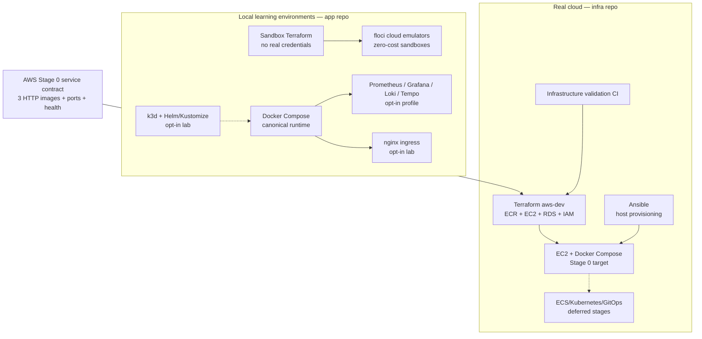

# Infrastructure Architecture — API Observatory

This document maps local learning infrastructure to the sibling repository that owns real-cloud
delivery. For application/service behavior, see
[Application Architecture](application-architecture.md); for topic status, see
[Evergreen Engineering Topics](engineering-topics.md).

## Ownership Rule

- `api-observatory` owns application behavior, contracts, service Dockerfiles, local Compose/k3d,
  zero-cost emulators, sandbox Terraform, tests, and developer bootstrap.
- `api-observatory-infra` owns real-cloud Terraform/state, IAM, networking, DNS/TLS, runtime secret
  delivery, cloud deployment workflows, and production-oriented monitoring assets.

The app repository publishes the machine-readable AWS Stage 0 service contract at
`infra/deployment/aws-stage0-services.json`; infrastructure consumes that interface.

## Topology

## Evidence Status

| Environment/capability | Status | Meaning |
| --- | --- | --- |
| Docker Compose application/data plane | **Core** | Canonical local runtime and test target |
| Local monitoring profile | **Lab** | Executable local observability stack, not managed operations |
| nginx edge, k3d, replicas, and HPA | **Lab** | Learning configuration; no production scale claim |
| AWS/Azure/GCP emulators and sandbox Terraform | **Lab** | Zero-cost API/IaC exercises, not real cloud behavior |
| AWS Stage 0 ECR + EC2 + RDS | **Decision** | Primary portfolio deployment direction; not yet verified live |
| Azure cloud assets | **Historical/reference** | Retained as secondary comparison, not the primary target |
| ECS, EKS/Kubernetes, GitOps, multi-region | **Deferred** | Require explicit scale, availability, or deployment triggers |

## AWS Stage 0 Contract

The intended first live proof uses three HTTP services:

- ingestor on port `8000`;
- inference on port `8001`;
- dashboard on port `8501`.

The MCP server remains a local stdio process and is not deployed. Images use immutable
`tree-<SHA>` tags. The app owns environment-variable names, ports, images, and health behavior; the
infra repo owns ECR, EC2, RDS, IAM, and secret delivery.

This is a documented and statically tested contract. A Terraform configuration, workflow, or plan
must not be described as a completed deployment. Real provisioning requires separate cost and
mutation approval, redacted evidence, rollback verification, and teardown.

## Evolution Triggers

| Change | Evidence required first |
| --- | --- |
| Multiple API replicas | Saturation or availability target, stateless request path, scheduler ownership plan |
| Dedicated scheduler/worker | Duplicate-job risk or independent job scaling/SLO requirement |
| ECS or Kubernetes | Repeated Compose deployment friction or independent workload scaling |
| Managed gateway | Multiple public services, consumer-specific policy, or edge-auth requirements |
| Read replicas/sharding | Measured single-node database limit after query, index, retention, and partition work |
| Multi-region | Explicit recovery objective that single-region backup/restore cannot meet |

## Change Checklist

Before changing ports, images, environment names, health endpoints, IAM, ingress, secret delivery,
or observability:

1. Update the machine-readable service contract when its interface changes.
2. Update the app's [contract checklist](../07-deployment/app-repo-contract.md).
3. Update the consuming Terraform/Ansible/workflow source in `api-observatory-infra`.
4. Verify local contract tests before any real-cloud plan.
5. Record evidence status honestly in the evergreen topic index.
