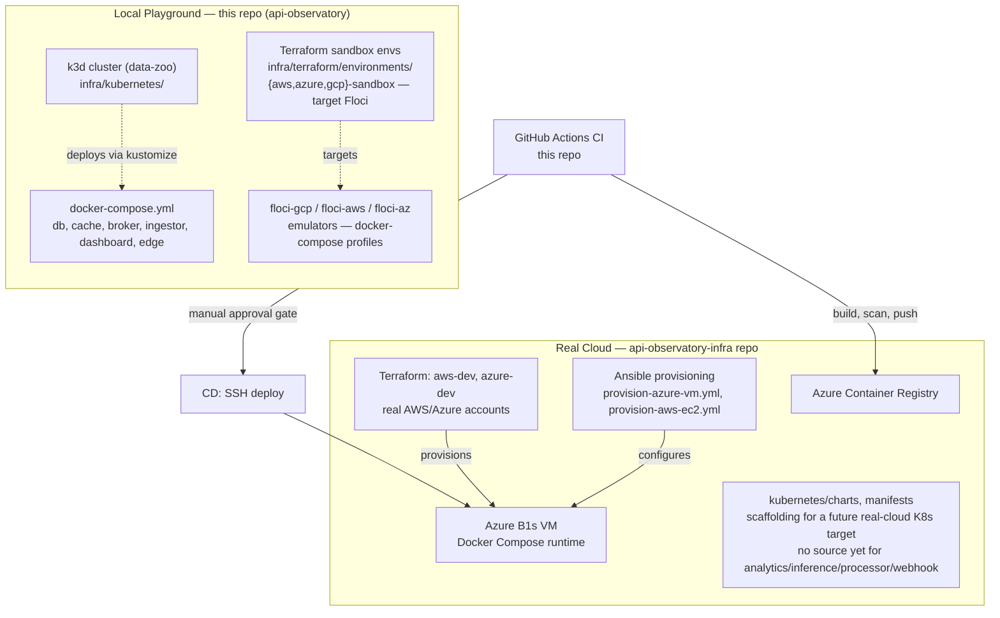

# Infrastructure Architecture — API Observatory

**Scope**: Deployment and platform topology across both repos. For application/service
structure, see [Application Architecture](application-architecture.md).

This project runs two infrastructure zones, split by a simple rule (from
`api-observatory-infra/docs/.plans/repo-split-app-infra.md`): **if it runs without
credentials and costs $0, it's local playground → this repo. If it touches a real cloud
account, it's infrastructure → `api-observatory-infra`.**

## Zones

### Local Playground (this repo)

- **Docker Compose** (`docker-compose.yml`) — the default local stack: Postgres, Redis,
  Redpanda, ingestor, dashboard, plus opt-in profiles for `monitoring`
  (Prometheus/Grafana/Loki/Alertmanager), `security` (Trivy/Checkov/gitleaks/hadolint),
  `ingress` (nginx edge), and per-cloud emulator profiles (`gcp`/`aws`/`azure` → floci-*).
- **k3d local Kubernetes** (`infra/kubernetes/`) — a single-node k3d cluster (`just k3s-up`)
  running the same ingestor/dashboard images against Bitnami Postgres/Redis + Redpanda Helm
  charts, fully self-contained (no dependency on the infra repo).
- **Sandbox Terraform** (`infra/terraform/environments/{aws,azure,gcp}-sandbox/`) — targets
  local emulators (floci-aws, floci-az, floci-gcp), zero cost, zero real credentials.

### Real Cloud (`api-observatory-infra` repo)

- **Dev Terraform** (`terraform/environments/{aws-dev,azure-dev}/`) — real AWS/Azure
  accounts; `azure-dev` is the active deploy target today (Azure Free Tier: B1s VM +
  PostgreSQL Flexible Server).
- **Ansible** — provisions the VM (Docker install, hardening) after Terraform creates it.
- **Kubernetes scaffolding** (`kubernetes/{charts,manifests}`) — Helm charts/manifests for a
  future real-cloud K8s deployment target; not active today since only `ingestor`/`dashboard`
  have source code (see [Application Architecture](application-architecture.md)'s
  Router/Feature Map for what's actually built).

### CI/CD

- This repo's `.github/workflows/ci.yml` builds/tests/scans and pushes images to ACR;
  `cd-dev.yml` deploys to the Azure VM via SSH behind a manual approval gate.
- `api-observatory-infra`'s `.github/workflows/ci.yml` validates Terraform
  (`fmt`/`validate`/`tflint`/`checkov`) and lints Helm charts — no CD/apply-on-merge workflow
  exists there yet (open gap, tracked separately).

## How to Update

- **New local emulator or sandbox env**: add a node under the `Local` subgraph.
- **New real-cloud environment or resource**: add a node under the `Cloud` subgraph, and
  cross-check `api-observatory-infra`'s `TERRAFORM_CHECKS.md` tracked-decisions table for
  anything that gates it (e.g. Stage 2/3 triggers).
- **Repo boundary changes** (something moves between local/cloud ownership): update this
  diagram AND `api-observatory-infra/docs/.plans/repo-split-app-infra.md`'s ownership table
  in the same change — they must stay in sync.
