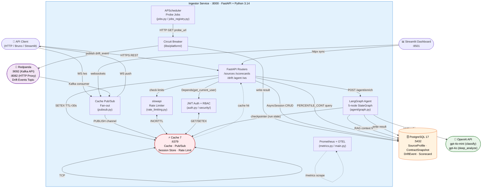

# Architecture Overview — api-observatory MVP

**MVP scope**: Commits 1-12 (PHASE 1-10). Single service (`ingestor`) + four infrastructure
components. No Django portal, no analytics service, no MongoDB.

---

## Visual Architecture: How the Services Communicate



---

## Request Flow: Key Paths

### 1. Probe Scheduler → Scorecard

```text
APScheduler (60s tick)
  └─ CB.call(httpx.get(source.probe_url))
       ├─ success → INSERT ContractSnapshot → compare schema → maybe INSERT DriftEvent
       │                                                      └─ publish to Redpanda topic
       └─ failure → CB opens after N failures
                  → probe_result = "error" recorded in DB

GET /api/v1/scorecards/{source_id}
  └─ SELECT PERCENTILE_CONT(0.95) ... GROUP BY window
       ├─ cache miss → compute → Cache SETEX 30s → return
       └─ cache hit  → return immediately
```

### 2. WebSocket Real-Time Push

```text
Browser opens WS /ws?token=<jwt>
  └─ JWT verified on handshake
       └─ subscribe to Cache channel "drift:events"

Probe detects schema drift
  └─ INSERT DriftEvent
       └─ Kafka publish → topic "drift.events"
            └─ Ingestor consumer reads → Cache PUBLISH "drift:events" payload
                 └─ All WS connections receive live push
```

### 3. LangGraph Agent Enrichment

```text
POST /api/v1/agent/enrich/{observation_id}
  └─ get_agent() → StateGraph execution
       ├─ fetch_context  → SELECT related observations (RAG)
       ├─ classify       → gpt-4o-mini (structured output, ~500ms)
       ├─ [if priority≥4 or category=unknown]
       │    └─ deep_analyze → gpt-4o (~1-2s)
       ├─ format_result  → build response payload
       └─ publish        → UPDATE observation + INSERT enrichment

POST /api/v1/agent/enrich/{observation_id}/review  (HITL mode)
  └─ get_agent_hitl() → StateGraph pauses before "publish"
       └─ checkpointer saves state in Cache
            └─ POST /api/v1/agent/runs/{run_id}/resume {"approve": true}
                 └─ resume from checkpoint → execute publish node
```

---

## Why Each Service: Justification

### PostgreSQL 17

**When**: Primary persistence for all domain data (sources, snapshots, drift events, scores).

**Why not SQLite**: Need concurrent async writes from scheduler + API + tests in parallel.
Need `PERCENTILE_CONT`, `JSON` operators, and `LISTEN/NOTIFY` for RLS.

**Key features used**:

- `PERCENTILE_CONT(0.95)` — 95th percentile latency in scorecard query, zero Python post-processing
- Row-level security (RLS) — tenant isolation on `SourceProfile`; alembic migrations own the policy
- `ON CONFLICT DO UPDATE` — upsert pattern for probe results without race conditions
- Async driver: `asyncpg` via SQLAlchemy 2.0 `AsyncSession`

**Env var**: `DATABASE_URL=postgresql+asyncpg://user:pass@db:5432/api_observatory`

---

### Cache 7

**When**: Any state that is ephemeral, high-frequency, or needs TTL — never the primary truth.

**Why not just PostgreSQL**: Cache gives sub-millisecond reads for hot paths and native pub/sub
for fan-out to N concurrent WebSocket clients (no polling loop needed).

**Five uses in this MVP**:

| Use | Cache primitive | File |
|-----|----------------|------|
| Scorecard cache | `SETEX key 30` | `cache.py` |
| WebSocket fan-out | `PUBLISH channel payload` | `pubsub.py` |
| JWT session store | `SETEX token:user_id ttl` | `auth.py` |
| Rate limiting | `INCR key` + `EXPIRE` | `rate_limiting.py` |
| Agent checkpointer | Hash keys per `thread_id` | `agent/graph.py` |

**Env vars**:

```bash
CACHE_ENABLED=true          # must be true for WebSocket, rate limiting, agent HITL
CACHE_URL=redis://cache:6379/0
```

**Fail-open**: When `CACHE_ENABLED=false`, rate limiter uses in-memory storage, cache misses fall
through to DB, agent uses `MemorySaver`. Safe for unit tests without infrastructure.

---

### Redpanda (Kafka-compatible broker)

**When**: Async, durable event delivery from the probe scheduler to any subscriber.

**Why not just Cache pub/sub for events**: Cache pub/sub is fire-and-forget — if no subscriber
is listening when a message arrives, it is lost. Redpanda persists to disk; consumers can catch up
after restart. Also enables multiple independent consumer groups (a future analytics service can
read `drift.events` without affecting the WebSocket consumer).

**Why not RabbitMQ**: Kafka API is the de-facto event streaming standard. Redpanda replaces Kafka's
JVM with a single native binary: starts in < 2s, full Kafka wire protocol compatibility. See ADR 001
in [docs/design/architecture.md](design/architecture.md).

**Topics in use**:

| Topic | Producer | Consumer | Purpose |
|-------|----------|----------|---------|
| `drift.events` | probe scheduler | pubsub consumer | Schema change detected |
| `drift.events.dlq` | consumer error handler | ops replay | Failed message replay |

**Ports**:

- `:9092` — Kafka wire protocol (aiokafka / kafka-python clients)
- `:8082` — HTTP Proxy (Pandaproxy, REST produce/consume)
- `:29092` — internal Docker network (`BROKER_URL=broker:29092`)

**Env vars**:

```bash
BROKER_ENABLED=true
BROKER_URL=broker:29092       # inside Docker Compose network
# BROKER_URL=localhost:9092     # if ingestor runs outside Docker
```

**Fail-open**: When `BROKER_ENABLED=false`, probe scheduler skips publishing. All probe results
still write to PostgreSQL. WebSocket clients receive no live events; polling `/api/v1/drift`
returns historical events normally.

---

### OpenAI API

**When**: observation enrichment agent calls classification or deep analysis nodes.

**Why dual-model**: `gpt-4o-mini` costs ~10x less than `gpt-4o`. Routing rule: mini for all
`classify` calls; escalate to full model only when `priority >= 4` or `category == "unknown"`.
See [ADR 012](adr/012-langgraph-agent.md).

**Env var**: `OPENAI_API_KEY=sk-...` (required only if `/api/v1/agent/*` endpoints are called)

**Fail-open**: All other endpoints are unaffected when key is absent. Agent returns `503`.

---

## Full Environment Variable Reference

Minimum set to run the full MVP feature stack:

```bash
# ── Database ─────────────────────────────────────────────────────────────────
DATABASE_URL=postgresql+asyncpg://postgres:postgres@db:5432/api_observatory

# ── Application ──────────────────────────────────────────────────────────────
ENVIRONMENT=development
LOG_LEVEL=INFO
SERVICE_VERSION=0.1.0

# ── JWT Auth ─────────────────────────────────────────────────────────────────
JWT_SECRET=change-me-32-chars-minimum-random-value
JWT_ALGORITHM=HS256
JWT_EXPIRY_MINUTES=30

# ── Cache (enables cache, pub/sub, rate limiting, agent checkpointer) ─────────
CACHE_ENABLED=true
CACHE_URL=redis://cache:6379/0

# ── Redpanda / Kafka (enables drift event streaming) ─────────────────────────
BROKER_ENABLED=true
BROKER_URL=broker:29092

# ── LangGraph Agent (optional — all other endpoints work without this) ─────────
OPENAI_API_KEY=sk-your-real-key-here

# ── Docs protection (optional) ───────────────────────────────────────────────
DOCS_USERNAME=admin
DOCS_PASSWORD=changeme

# ── Observability (optional — /metrics always exposed) ───────────────────────
OTEL_ENABLED=false
OTEL_ENDPOINT=http://localhost:4317
OTEL_SERVICE_NAME=api-obs-ingestor
```

The `docker-compose.yml` sets `BROKER_URL`, `CACHE_URL`, and `SERVICE_VERSION` automatically.
Copy `.env.example` to `.env`, set `CACHE_ENABLED=true` + `BROKER_ENABLED=true`, and add a real
`OPENAI_API_KEY` for the full feature set.

---

## Component Status by Commit

| Commit | Phase | Components Added | Status |
|--------|-------|-----------------|--------|
| 1 | Foundation | FastAPI, SQLAlchemy 2.0, PostgreSQL, Redpanda, Cache | ✅ |
| 2 | Docs | README, tech-map, learning-paths | ✅ |
| 3 | DevEx | Copilot instructions, pre-commit hooks, skills | ✅ |
| 4 | Source Registry | `SourceProfile` CRUD, SSRF prevention | ✅ |
| 5 | Probe Scheduler | APScheduler, HTTP probes, circuit breaker | ✅ |
| 6 | Scorecard | `PERCENTILE_CONT` aggregation, rolling 24h window | ✅ |
| 6b | Contract Drift | Schema snapshot diff, severity classification | ✅ |
| 6c | WebSocket | Cache pub/sub, JWT on handshake, live fan-out | ✅ |
| 8b | Streamlit | 5-panel real-time dashboard | ✅ |
| 8c | Bruno | 9 collections, 24+ requests, living API docs | ✅ |
| 9 | Auth | JWT access/refresh tokens, admin/viewer RBAC | ✅ |
| 10 | Observability | structlog, Prometheus, OTEL, `/health` + `/readyz` | ✅ |
| 11 | Resilience | slowapi rate limiting, circuit breaker, `Retry-After` | ✅ |
| 12 | Agent | LangGraph 5-node StateGraph, HITL, SSE streaming | ✅ |

**Next**: Commit 13 — Deployment (Docker image audit, Terraform ECS, E2E tests).

---

## Related Docs

- [docs/tech-map.md](tech-map.md) — interview topic → file:function map
- [docs/adr/012-langgraph-agent.md](adr/012-langgraph-agent.md) — dual-model cost design
- [docs/design/architecture.md](design/architecture.md) — extended diagrams, ADR 001 (Kafka vs RabbitMQ)
- [docs/dev/bruno-collections.md](dev/bruno-collections.md) — API testing with Bruno CLI
- [docs/dev/streamlit-dashboard.md](dev/streamlit-dashboard.md) — dashboard usage guide
