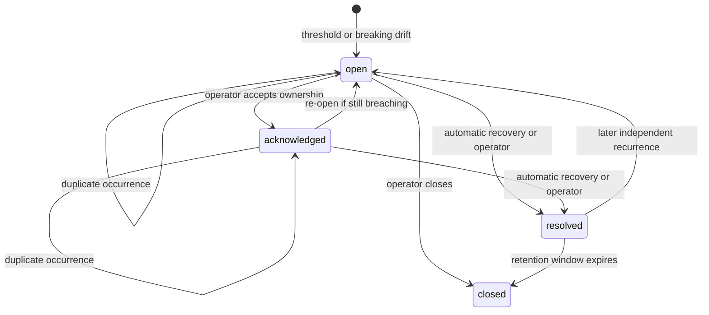

# Dependency Incident Lifecycle

API Observatory turns repeated dependency failures into a tenant-scoped operational record rather
than a stream of unrelated alerts.

## Practical Value

- **Who:** a solo SaaS developer whose application depends on external APIs.
- **Failure or cost:** repeated probes and contract changes create noisy signals without ownership,
  status, or recovery evidence.
- **Risk reduction:** one deduplicated incident records occurrences, deterministic guidance, human
  acknowledgement, resolution, notification cooldown, and operational metrics.
- **Scale limit:** the in-process evaluation path is appropriate for the current probe volume;
  sustained high-volume or multi-region evaluation would require partitioned workers and stronger
  concurrency control.

## State Machine

Only active incidents retain an `active_key`. Its unique index prevents two active rows for the
same tenant, source, and trigger; resolution clears it so a later recurrence can create a new
incident.

## Triggers

- **Availability:** opens after `incident_failure_threshold` consecutive failed health samples and
  resolves on the next successful sample.
- **Latency:** when `latency_threshold_ms` is configured, opens after the same number of consecutive
  successful-but-slow samples and resolves below the threshold.
- **Drift:** breaking or critical contract drift opens an incident. Resolution is manual because a
  later schema change does not prove downstream compatibility.

Source policy defaults to two consecutive failures and a 15-minute notification cooldown. Latency
incidents are opt-in because an arbitrary global threshold would be misleading.

## Tenant and Notification Boundaries

`SourceProfile.tenant_id` is copied into samples, drift observations, and incidents. Non-admin
incident API identities require a tenant claim and queries filter by that tenant; cross-tenant
lookups return `404`. Operators can acknowledge and resolve only visible incidents. Admins retain a
global operational view.

The database transaction commits the sample or drift and incident before provider notification is
attempted. Slack, Telegram, email, and outbound-webhook delivery reuse the existing fail-open
dispatcher. A provider outage therefore cannot erase incident evidence. Cooldown suppresses repeat
notifications while occurrence counts continue to increase.

## Evidence

- Model and policy: [`models.py`](../../services/ingestor/models.py) and
  [`repositories/incidents.py`](../../services/ingestor/repositories/incidents.py)
- Application orchestration: [`incident_lifecycle.py`](../../services/ingestor/incident_lifecycle.py)
- API: [`routers/incidents.py`](../../services/ingestor/routers/incidents.py)
- Migration: [`20260724_120000_add_dependency_incidents.py`](../../alembic/versions/20260724_120000_add_dependency_incidents.py)
- Dashboard: [`panels/incidents.py`](../../services/dashboard/ui/streamlit/panels/incidents.py)

Focused proof lives in
[`test_incident_lifecycle.py`](../../services/ingestor/tests/unit/core/test_incident_lifecycle.py),
[`test_incidents_api.py`](../../services/ingestor/tests/integration/test_incidents_api.py), and
[`test_contract_drift_api.py`](../../services/ingestor/tests/integration/test_contract_drift_api.py).

## Failure, Signals, and Rollback

Watch `pipeline_dependency_incident_transitions_total{trigger_type,transition}`, provider-health
samples, notification results, HTTP errors, and correlated traces. Important failure modes are a
bad threshold, concurrent duplicate opens, notification storms, false automatic recovery, missing
tenant ownership, and an operator transition race.

Rollback is expand-first: deploy the nullable source columns and incident table before application
code, and retain the old observation/agent drift evidence during adoption. Application rollback can
ignore the additive table. Database downgrade is safe only after confirming no incident evidence
must be retained.

At 10x load, batch evaluation and tune the health-sample index/query. At 100x, partition evaluation
by tenant/source, separate API serving from incident workers, use transactional-outbox notification
delivery, and define explicit incident-processing and recovery SLOs.
