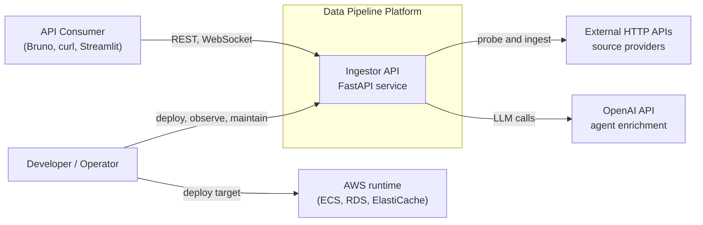
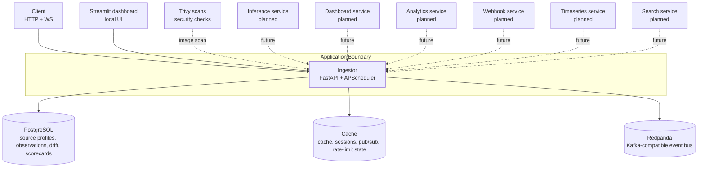
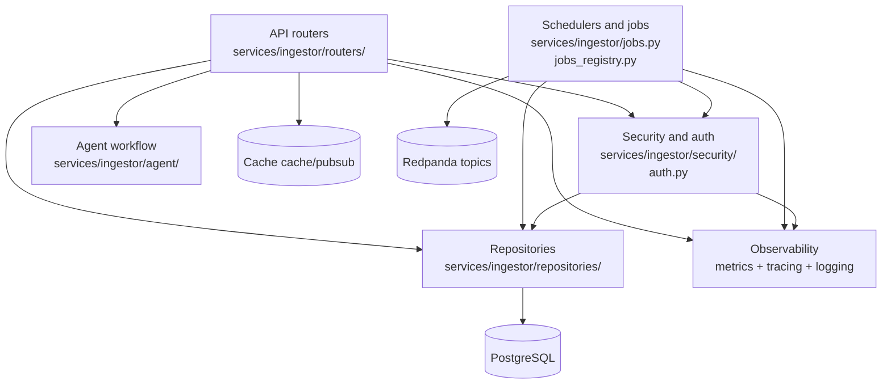

# System Design C4

Track: C - Architecture and Platform Strategy

This document complements the flow-oriented architecture guide in [docs/04-architecture-overview.md](../04-architecture-overview.md) with a C4 viewpoint:

- Level 1: system context
- Level 2: containers
- Level 3: components inside the ingestor service

## Scope

Current focus is the MVP runtime centered on the ingestor service and its core data and messaging dependencies.
Future services are shown as planned extensions, not active dependencies.

## Level 1: Context

## Level 2: Containers

## Level 3: Components (Ingestor)

## Design Notes

- The architecture document in [docs/04-architecture-overview.md](../04-architecture-overview.md) remains the request-flow deep dive.
- This C4 document is the structural map for onboarding, planning, and cross-team communication.
- Future services are intentionally shown as planned edges to keep MVP boundaries explicit.

## Related Documents

- [docs/04-architecture-overview.md](../04-architecture-overview.md)
- [docs/monorepo-structure.md](../monorepo-structure.md)
- [docs/observability.md](../observability.md)
